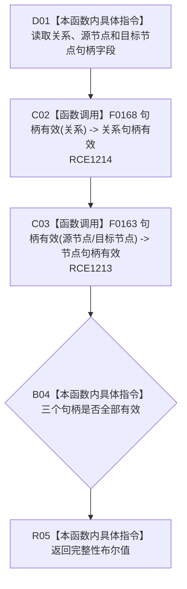

# CF-L10-0073 特征关系证据完整现状流程图

图类型：现状流程图
代码版本：`3920a74638264f9f539d50f32f3c9fe5fb1982ab`
源码 blob：`a47cd9b07794d30abc6cb9d1df319056105cd596`
覆盖文件：`海中鱼巣/领域/数据操作.特征体系.ixx:63-65`
唯一根函数：R0387
完整签名：`bool 海中鱼巣::特征关系证据::完整() const noexcept`
参数：无；隐式 `this` 为只读借用，不延长特征关系证据生命周期
返回结果：关系句柄、源节点句柄、目标节点句柄全部有效时返回 true，否则返回 false
调用图：`流程图/主程序可达调用关系/01_main可达项目调用边表.md`
逐行映射表：`流程图/代码流程图/L10/CF-L10-0073_特征关系证据完整_逐行代码映射表.md`
输入契约 / 调用语境表：调用方传入或持有的值式关系证据
非成功返回二分审查表：false 为封闭局部完整性判断；上游保证完整后的 false 由调用方按内部错误处理
偏差清单：无新增聚合边差异
依据提交 / 结构化消息：聚合关系基线 `caab8644416dea13ea598b714289d1c86ac05304`；冻结源码提交 `3920a74638264f9f539d50f32f3c9fe5fb1982ab`
验证输出：本批 Mermaid、节点双向、源码覆盖与差异格式检查
不得作为施工许可：是
不得宣称：返回 true 表示关系仍在仓库中有效或当前可读

## 流程图

## 当前边界

- RCE1214 仅对应关系句柄；RCE1213 对应源节点、目标节点两个节点句柄调用点。
- 本函数不读取关系仓库状态、版本或失效位，只检查值式证据内三个句柄的结构有效性。
