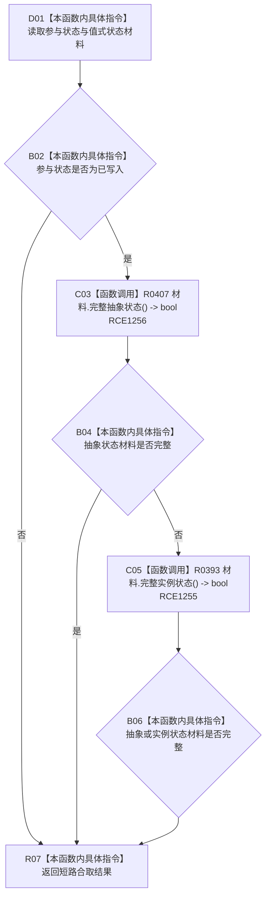

# CF-L10-0074 状态写入参与结果成功现状流程图

图类型：现状流程图
代码版本：`3920a74638264f9f539d50f32f3c9fe5fb1982ab`
源码 blob：`cc399ea69282bf3ae0b0d59c7f0b587e5164b187`
覆盖文件：`海中鱼巣/领域/数据操作.状态动态.ixx:304-307`
唯一根函数：R0401
完整签名：`bool 海中鱼巣::状态写入参与结果::成功() const noexcept`
参数：无；隐式 `this` 为只读借用，不延长状态写入参与结果生命周期
返回结果：参与状态为 `已写入`，且材料是完整抽象状态或完整实例状态时返回 true；否则返回 false
已登记调用方：R0341、R0455（RCE1408、RCE2741）
直接项目函数：R0407（RCE1256）、R0393（RCE1255）
外部边界：无
逐行映射表：`流程图/代码流程图/L10/CF-L10-0074_状态写入参与结果成功_逐行代码映射表.md`
结构读取与写入：只读局部值式参与结果；不读写仓库、关系、索引或其它机器结构
逻辑内返回：入口或调用语境允许未写入、材料不完整时返回 false
内部错误边界：上游已确认写入成功后，本函数仍返回 false 时由调用方作为参与结果不一致处理
依据提交 / 结构化消息：聚合关系基线 `caab8644416dea13ea598b714289d1c86ac05304`；冻结源码提交 `3920a74638264f9f539d50f32f3c9fe5fb1982ab`
验证输出：本批 Mermaid、节点双向、源码覆盖与差异格式检查
不得作为施工许可：是
不得宣称：返回 true 表示状态结构已经统一发布或在事务外仍为当前事实

## 流程图

## 当前边界

- 第 306 行按 `||` 短路：抽象状态材料完整时不调用 R0393；仅在抽象状态材料不完整时复核实例状态材料。
- R0407、R0393 的非平凡完整性判断分别由其独立单函数图承载；本函数只组合参与状态与两类材料结果。
