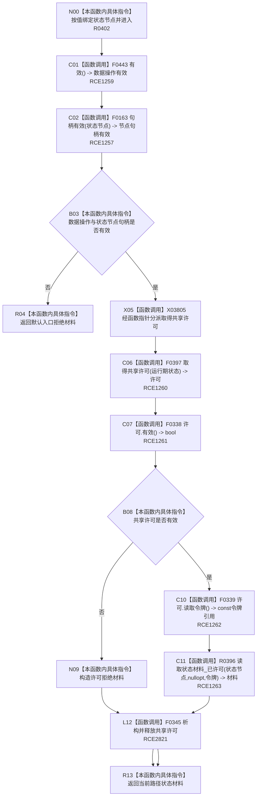

# CF-L10-0075 状态动态读取状态材料现状流程图

图类型：现状流程图
代码版本：`3920a74638264f9f539d50f32f3c9fe5fb1982ab`
源码 blob：`cc399ea69282bf3ae0b0d59c7f0b587e5164b187`
覆盖文件：`海中鱼巣/领域/数据操作.状态动态.ixx:376-381`
唯一根函数：R0402
完整签名：`海中鱼巣::状态值式材料 海中鱼巣::状态动态数据操作::读取状态材料(海中鱼巣::节点句柄 状态节点) const`
参数：`状态节点` 按值传入；函数不延长节点句柄生命周期
返回结果：数据操作或节点句柄无效时返回默认入口拒绝材料；共享许可无效时返回许可拒绝材料；许可有效时返回 R0396 的已许可读取结果
已登记调用方：R0460（RCE1426）
直接项目函数：F0443（RCE1259）、F0163（RCE1257）、F0397（RCE1260）、F0338（RCE1261）、F0339（RCE1262）、R0396（RCE1263）、F0345（RCE2821，待聚合）
外部边界：X03805（共享许可函数指针分派，待聚合）
逐行映射表：`流程图/代码流程图/L10/CF-L10-0075_状态动态读取状态材料_逐行代码映射表.md`
结构读取与写入：只读已发布状态结构；局部共享许可在全部许可后返回路径释放
逻辑内返回：数据操作无效、状态节点句柄无效或共享许可拒绝
内部错误边界：许可与入口前置成立后，由 R0396 对状态结构缺项、重复或类型漂移分类
依据提交 / 结构化消息：聚合关系基线 `caab8644416dea13ea598b714289d1c86ac05304`；冻结源码提交 `3920a74638264f9f539d50f32f3c9fe5fb1982ab`
验证输出：本批 Mermaid、节点双向、源码覆盖与差异格式检查
不得作为施工许可：是
不得宣称：取得许可或返回材料表示状态仍在许可生命周期外当前可读

## 流程图

## 当前边界

- RCE1258 把第 377 行节点句柄误绑为 F0168 关系句柄重载，必须停用；第 377 行只保留 RCE1257 → F0163。
- RCE1259 只对应第 377 行本对象 `有效()`；其旧调用点中的第 379 行实际由 RCE1261 → F0338 承载。
- 第 378 行函数指针当前唯一解析到 F0397，同时保留 X03805 的原始函数指针分派边界；许可对象在第 378 行之后的全部返回路径经 RCE2821 调 F0345 释放。
- R0396 的非平凡状态材料读回由 `流程图/代码流程图/L11/CF-L11-0080_状态动态读取状态材料已许可_现状流程图.md` 独立承载。
