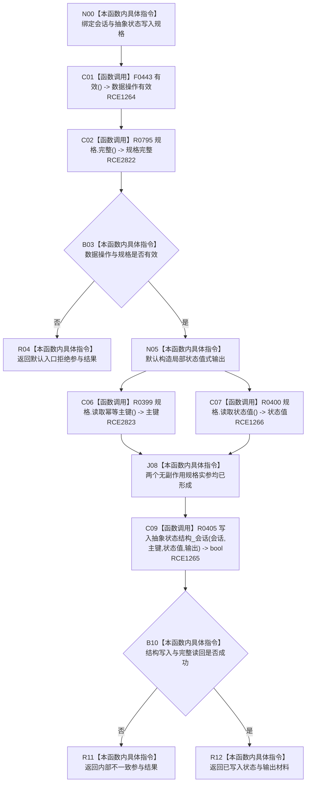

# CF-L10-0076 状态动态写入抽象状态会话现状流程图

图类型：现状流程图
代码版本：`3920a74638264f9f539d50f32f3c9fe5fb1982ab`
源码 blob：`cc399ea69282bf3ae0b0d59c7f0b587e5164b187`
覆盖文件：`海中鱼巣/领域/数据操作.状态动态.ixx:406-416`
唯一根函数：R0403
完整签名：`海中鱼巣::状态写入参与结果 海中鱼巣::状态动态数据操作::写入抽象状态_会话(海中鱼巣::结构写入会话& 会话, const 海中鱼巣::抽象状态写入规格& 规格) const`
参数：`会话` 为调用期可写借用；`规格` 为调用期只读借用；函数不延长二者生命周期
返回结果：入口无效返回默认入口拒绝；结构写入失败返回内部不一致；结构写入成功返回 `已写入` 与完整值式材料
已登记调用方：R0341、R0433、R0455（RCE1083、RCE1344、RCE1407）
直接项目函数：F0443（RCE1264）、R0795（RCE2822，待聚合）、R0399（RCE2823，待聚合）、R0400（RCE1266）、R0405（RCE1265）
外部边界：无
逐行映射表：`流程图/代码流程图/L10/CF-L10-0076_状态动态写入抽象状态会话_逐行代码映射表.md`
结构读取与写入：入口通过后委托 R0405 在既有结构写入会话中形成主信息、状态节点、I64 值和主键绑定候选；本函数只组合参与结果
逻辑内返回：数据操作无效或规格不完整时在第一笔结构写入前入口拒绝
内部错误边界：规格通过后 R0405 任一候选写入或完整读回失败，返回 `内部不一致`
依据提交 / 结构化消息：聚合关系基线 `caab8644416dea13ea598b714289d1c86ac05304`；冻结源码提交 `3920a74638264f9f539d50f32f3c9fe5fb1982ab`
验证输出：本批 Mermaid、节点双向、源码覆盖与差异格式检查
不得作为施工许可：是
不得宣称：返回 `已写入` 表示会话已经确认、发布或对普通读取者可见

## 流程图

## 当前边界

- 第 409 行 `规格.完整()` 精确绑定 R0795；旧聚合只记录本对象 F0443，遗漏 R0795。
- 第 412 行同一调用表达式读取幂等主键与状态值；两个无副作用实参的 C++ 求值先后不由源码冻结，图以汇合节点表达二者均完成后才进入 R0405。
- R0405 承载非平凡候选写入与读回，由 `流程图/代码流程图/L11/CF-L11-0081_状态动态写入抽象状态结构会话_现状流程图.md` 独立展开。
