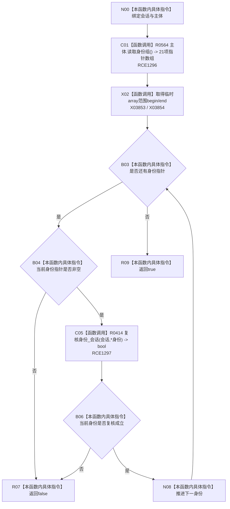

# CF-L10-0077 系统角色复核主体身份会话现状流程图

图类型：现状流程图
代码版本：`3920a74638264f9f539d50f32f3c9fe5fb1982ab`
源码 blob：`b24322d4588808299a232bc308bebd463b7a87a0`
覆盖文件：`海中鱼巣/领域/数据操作.系统角色.ixx:255-262`
唯一根函数：R0415
完整签名：`bool 海中鱼巣::系统角色数据操作::复核主体身份_会话(海中鱼巣::结构写入会话& 会话, const 海中鱼巣::系统角色主体材料& 主体) const`
参数：`会话` 为可写会话借用但本函数只读；`主体` 为只读借用
返回结果：主体身份组每项指针非空且均经 R0414 复核成立时返回 true，否则 false
已登记调用方：R0410（RCE1286）
直接项目函数：R0564（RCE1296）、R0414（RCE1297）
外部边界：X03853（临时身份指针数组 `begin`）、X03854（同数组 `end`）
逐行映射表：`流程图/代码流程图/L10/CF-L10-0077_系统角色复核主体身份会话_逐行代码映射表.md`
结构读取与写入：只读主体身份组和当前会话结构
逻辑内返回：无；false 由 R0410 记为内部不一致
内部错误边界：任一身份指针为空或身份读回不一致
依据提交 / 结构化消息：聚合关系基线 `7951b1bea78c7338643ab18428180d521e4d5a62`；冻结源码提交 `3920a74638264f9f539d50f32f3c9fe5fb1982ab`
验证输出：本批 Mermaid、节点双向、源码覆盖与差异格式检查
不得作为施工许可：是
不得宣称：全部身份复核成立表示主体关系拓扑也已复核

## 流程图

## 当前边界

- R0564 返回固定长度指针数组；R0415 不缓存元素指针，不延长主体生命周期。
- 任一失败立即短路返回，不再读取后续身份；false 在唯一上层 R0410 中被解释为内部不一致。
