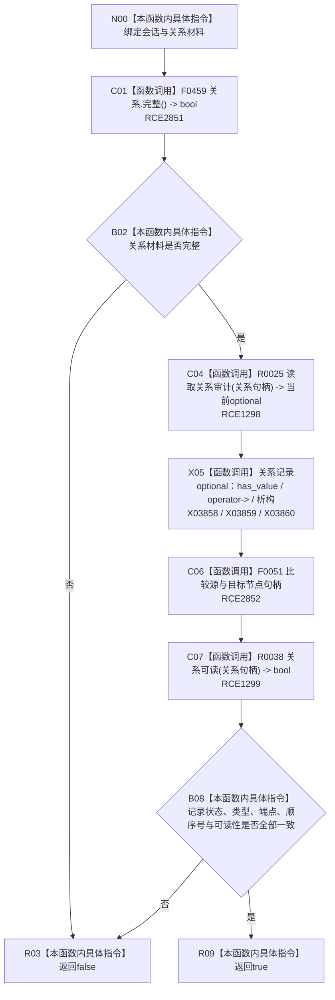

# CF-L10-0078 系统角色复核精确关系会话现状流程图

图类型：现状流程图
代码版本：`3920a74638264f9f539d50f32f3c9fe5fb1982ab`
源码 blob：`b24322d4588808299a232bc308bebd463b7a87a0`
覆盖文件：`海中鱼巣/领域/数据操作.系统角色.ixx:281-290`
唯一根函数：R0417
完整签名：`bool 海中鱼巣::系统角色数据操作::复核精确关系_会话(海中鱼巣::结构写入会话& 会话, const 海中鱼巣::系统角色关系材料& 关系) const`
参数：`会话` 为可写会话借用但本函数只读；`关系` 为只读借用
返回结果：材料完整、关系审计存在并与全部字段一致且关系可读时返回 true，否则 false
已登记调用方：R0410（RCE1287）
直接项目函数：F0459（RCE2851）、R0025（RCE1298）、F0051（RCE2852，两处）、R0038（RCE1299）
外部边界：X03858—X03860
逐行映射表：`流程图/代码流程图/L10/CF-L10-0078_系统角色复核精确关系会话_逐行代码映射表.md`
结构读取与写入：只读会话内关系审计和关系可读性
逻辑内返回：无；false 由 R0410 记为内部不一致
内部错误边界：主体材料已通过上层前置后关系不完整或精确读回不一致
依据提交 / 结构化消息：聚合关系基线 `7951b1bea78c7338643ab18428180d521e4d5a62`；冻结源码提交 `3920a74638264f9f539d50f32f3c9fe5fb1982ab`
验证输出：本批 Mermaid、节点双向、源码覆盖与差异格式检查
不得作为施工许可：是
不得宣称：关系可读表示整个世界拓扑已经完整

## 流程图

## 当前边界

- RCE2852 聚合第 287、288 行两个节点句柄相等调用，均落到 F0051。
- X03858—X03860 分别封闭关系审计 optional 的有值、五次箭头访问和作用域析构。
