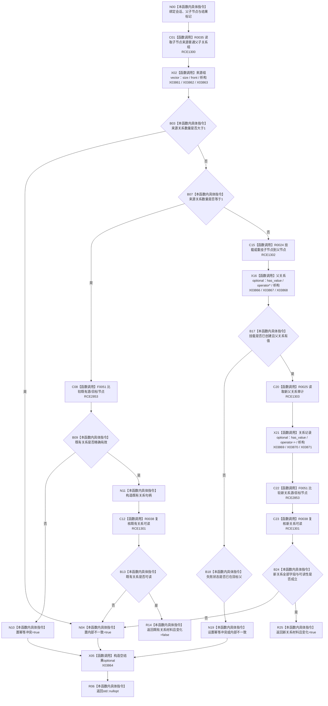

# CF-L10-0079 系统角色确保普通父子会话现状流程图

图类型：现状流程图
代码版本：`3920a74638264f9f539d50f32f3c9fe5fb1982ab`
源码 blob：`b24322d4588808299a232bc308bebd463b7a87a0`
覆盖文件：`海中鱼巣/领域/数据操作.系统角色.ixx:292-336`
唯一根函数：R0418
完整签名：`std::optional<海中鱼巣::系统角色数据操作::关系与变化> 海中鱼巣::系统角色数据操作::确保普通父子_会话(海中鱼巣::结构写入会话& 会话, 海中鱼巣::节点句柄 父节点, 海中鱼巣::节点句柄 子节点, bool& 幂等冲突, bool& 内部不一致) const`
参数：`会话` 为可写借用；父/子节点按值传入；两个结果标记为调用方拥有的可写借用
返回结果：既有精确父子关系返回 `{关系材料,false}`；新挂载并完整读回返回 `{关系材料,true}`；冲突或内部不一致返回空 optional 并设置对应标记
已登记调用方：R0410（RCE1288，两处）
直接项目函数：R0035（RCE1300）、F0051（RCE2853，四处）、R0038（RCE1301，两处）、R0024（RCE1302）、R0025（RCE1303）
外部边界：X03861—X03871
逐行映射表：`流程图/代码流程图/L10/CF-L10-0079_系统角色确保普通父子会话_逐行代码映射表.md`
结构读取与写入：读取子节点来源普通父子关系；不存在时经会话挂载或重挂并读回父关系
逻辑内返回：精确既有关系为幂等成功；既有关系字段冲突或挂载报告已在目标父被映射为幂等冲突
内部错误边界：多条来源父关系、关系不可读、挂载非预期状态或新关系读回不一致
依据提交 / 结构化消息：聚合关系基线 `7951b1bea78c7338643ab18428180d521e4d5a62`；冻结源码提交 `3920a74638264f9f539d50f32f3c9fe5fb1982ab`
验证输出：本批 Mermaid、节点双向、源码覆盖与差异格式检查
不得作为施工许可：是
不得宣称：返回带值表示会话已经提交或关系已对普通读取可见

## 流程图

## 当前边界

- RCE2853 聚合既有和新关系各两次节点句柄相等；RCE1301 聚合既有与新关系两处 `关系可读`。
- X03866—X03868 封闭 `节点挂载结果::父关系` optional；X03869—X03871 封闭新关系审计 optional；X03864/X03865 分账空结果和值结果构造。
- 新挂载只形成会话候选；最终提交由 R0410 在结构确有变化后请求。
