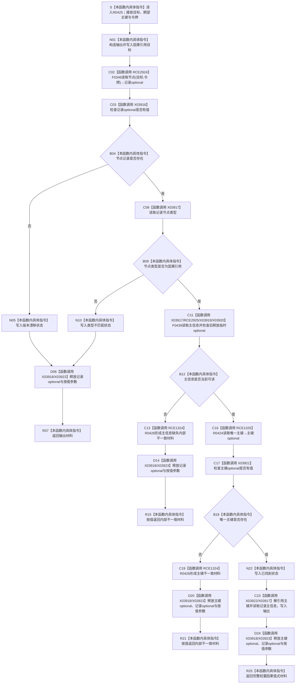

# CF-L10-0080 读取因果引用已许可现状流程图

图类型：现状流程图
代码版本：`3920a74638264f9f539d50f32f3c9fe5fb1982ab`
当前工作区复核基线：`7951b1bea78c7338643ab18428180d521e4d5a62`
源码 blob：`fdc9a1b062b28feffec733dd1a0e342812ef1ddc`
覆盖文件：`海中鱼巣/领域/数据操作.轻量因果.ixx:214-240`
唯一根函数：R0425
完整签名：`海中鱼巣::轻量因果值式材料 海中鱼巣::轻量因果数据操作::读取因果引用_已许可(海中鱼巣::节点句柄 目标, std::optional<std::uint64_t> 期望主键, const 海中鱼巣::结构事务令牌& 令牌) const`
参数：隐式 `this` 为 const 数据操作非拥有借用；`目标` 与 `期望主键` 按值传入；`令牌` 为调用期 const 引用，本函数不保存
返回结果：目标记录缺失时返回 `版本漂移`；节点类型不符时返回 `类型不匹配`；必需主信息或唯一主键不一致时经 R0426 返回 `内部不一致`；全部复核通过时返回含因果引用、幂等主键与主信息句柄的 `已找到` 值式材料
调用方：R0423 经 RCE1322
直接项目函数：RCE1324、RCE1325、RCE2924、RCE2925
符号外部边界：X03916—X03923
调用图：`流程图/主程序可达调用关系/01_main可达项目调用边表.md`
外部边界表：`流程图/主程序可达调用关系/02_main可达外部边界表.md`
逐行映射表：`流程图/代码流程图/L10/CF-L10-0080_读取因果引用已许可_逐行代码映射表.md`
输入契约 / 调用语境表：本文“读取语境与非成功分账”
非成功返回二分审查表：本文“读取语境与非成功分账”
偏差清单：本文“当前边界与规范核对”
依据提交 / 结构化消息：冻结源码提交 `3920a74638264f9f539d50f32f3c9fe5fb1982ab`；在当前 `main` 基线 `7951b1bea78c7338643ab18428180d521e4d5a62` 复核目标源码零差异
验证输出：27 行源码完整映射；4 个项目出边、8 个外部边界、0 个未解析项目调用；本切片不运行构建或程序
依据：`规范/0050_项目通用机器逻辑与禁止性规则总纲_20260721.md`、`规范/0600_代码函数流程图应用与维护规范.md`、`规范/1190_根规范_因果_20260720.md`、`规范/4010_子规范_统一仓库稳定句柄与通用关系索引边界.md`、`规范/4020_子规范_领域类型化数据记录与组合读取投影边界.md`、`规范/4040_子规范_不透明结构事务候选确认撤销与最后发布.md`、`规范/4050_子规范_入口拒绝逻辑内结果与内部逻辑错误.md`
不得作为施工许可：是
不得宣称：`已找到` 轻量引用等于完整稳定因果事实、读取材料是第二份持久化权威事实、内部不一致已因诊断调用而修复，或本函数修改 / 发布了节点、主信息、索引或因果结构

## 流程图

## 项目源码调用合同

| 调用边 | 节点 | 被调函数 | 实参与结果 |
| --- | --- | --- | --- |
| RCE2924 | C02 | F0346 `节点仓库::读取节点(节点句柄,const 结构事务令牌&) const` | `目标`、`令牌`；返回节点记录 optional |
| RCE2925 | C11 | F0439 `主信息仓库::读取主信息(主信息句柄,const 结构事务令牌&) const` | `记录->主信息`、`令牌`；只消费 `has_value()` |
| RCE1325 | C16 | R0424 `读取唯一主键_已许可(...) const` | `目标`、按值 `期望主键`、`令牌`；返回主键 optional |
| RCE1324 | C13 / C19 | R0426 `因果内部不一致(节点句柄,const wchar_t*)` | `目标` 与具名说明；形成内部不一致材料 |

## 外部边界

| 边界 | 调用点 | 静态调用 | 次数 |
| --- | --- | --- | --- |
| X03916 | 221 | `bool std::optional<海中鱼巣::节点记录>::has_value() const noexcept` | 1 |
| X03917 | 225、229、238 | `const 海中鱼巣::节点记录* std::optional<海中鱼巣::节点记录>::operator->() const noexcept` | 3 |
| X03918 | 220-240 | `std::optional<海中鱼巣::节点记录>::~optional()` | 1 |
| X03919 | 229 | `bool std::optional<海中鱼巣::主信息记录>::has_value() const noexcept` | 1 |
| X03920 | 229 | `std::optional<海中鱼巣::主信息记录>::~optional()` | 1 |
| X03921 | 233 | `bool std::optional<std::uint64_t>::has_value() const noexcept` | 1 |
| X03922 | 237 | `const std::uint64_t& std::optional<std::uint64_t>::operator*() const& noexcept` | 1 |
| X03923 | 214-240、232-240 | `std::optional<std::uint64_t>::~optional()` | 2 |

## 读取语境与非成功分账

| 节点 | 返回条件 | 二分口径 | 结构变化 |
| --- | --- | --- | --- |
| B04 / R07 | 目标节点记录不可读 | `版本漂移` 逻辑内返回 | 无 |
| B09 / R07 | 当前节点类型不是因果引用 | `类型不匹配` 逻辑内返回 | 无 |
| B12 / R15 | 因果引用记录存在但主信息不可读 | `内部不一致`，追根因解决 | 无；诊断不改变结构 |
| B18 / R21 | 因果引用没有唯一非零且双向一致的主键 | `内部不一致`，追根因解决 | 无；诊断不改变结构 |
| R25 | 节点、类型、主信息和唯一主键全部复核通过 | 正常值式读取 | 无；只组合一次读取投影 |

## 当前边界与规范核对

- R0425 只组合节点记录、主信息可读性与唯一主键为值式轻量因果材料；该投影不持久化、不反写，也不升级为完整因果事实。
- 220 行令牌重载节点读取由 RCE2924 指向 F0346；229 行令牌重载主信息读取由 RCE2925 指向 F0439。
- 232 行把 `期望主键` 按值传给 R0424；现有聚合口径不为普通参数复制另建边界，X03923 只登记 R0425 自身按值参数和局部 `主键` 两个 optional 的静态析构点。
- 主信息或唯一主键缺失发生在节点身份与类型前置通过之后，当前代码经 R0426 形成内部不一致材料并调用人读诊断；诊断不修复结构。
- 本图登记当前代码事实，不修改共享关系表，也不把 RCE2924—RCE2925 / X03916—X03923 写成已发布聚合事实。
