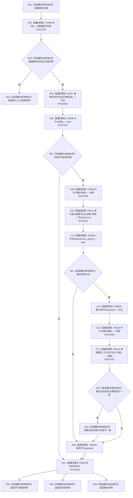

# CF-L10-0081 需求任务方法读取主键需求现状流程图

图类型：现状流程图
代码版本：`3920a74638264f9f539d50f32f3c9fe5fb1982ab`
源码 blob：`16ac9534baeda26ac8a712066e713f3339f6e0c8`
覆盖文件：`海中鱼巣/领域/数据操作.需求任务方法.ixx:1110-1122`
唯一根函数：R0429
完整签名：`需求权威材料 海中鱼巣::需求任务方法数据操作::读取主键需求(std::uint64_t 主键) const`
参数：`主键` 按值传入；零值非法
返回结果：入口无效返回默认材料；许可拒绝、未找到或已许可读取结果按结构化状态返回；已找到但主键回显不一致时改写为内部不一致
已登记调用方：R0454、R0759（RCE1401、RCE2585）
直接项目函数：F0448（RCE1328）、F0397（RCE2953）、F0338（RCE1329）、F0339（RCE1330）、F0441（RCE1331）、R0442（RCE1332）、F0345（RCE2954）
外部边界：X03931—X03933
逐行映射表：`流程图/代码流程图/L10/CF-L10-0081_需求任务方法读取主键需求_逐行代码映射表.md`
结构读取与写入：只读运行期索引与需求材料；只改写局部输出状态，不写机器结构
逻辑内返回：入口拒绝、许可拒绝和主键未找到
内部错误边界：读取结果为已找到但身份幂等主键与请求主键不一致
依据提交 / 结构化消息：当前维护基线 `7951b1bea78c7338643ab18428180d521e4d5a62`；冻结源码提交 `3920a74638264f9f539d50f32f3c9fe5fb1982ab`
不得作为施工许可：是
不得宣称：已找到结果表示需求结构符合全部领域合同

## 流程图

## 当前边界

- F0397 与 F0345 分别闭合共享许可取得和析构；RCE1329、RCE1330 保留许可有效与令牌读取。
- X03931—X03933 分别记录节点 optional 的存在检查、解引用和生命周期。
- 主键回显不一致只改写局部输出状态，不修复索引或需求结构。
