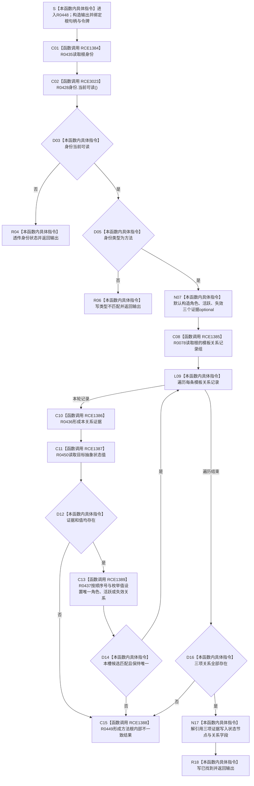

# CF-L10-0082 读取方法登记根已许可现状流程图

图类型：现状流程图
代码版本：`3920a74638264f9f539d50f32f3c9fe5fb1982ab`
当前工作区复核基线：`af74e46ef3fd0b1b2c108d695569855909a59ee1`
源码 blob：`16ac9534baeda26ac8a712066e713f3339f6e0c8`
覆盖文件：`海中鱼巣/领域/数据操作.需求任务方法.ixx:2513-2550`
唯一根函数：R0448
完整签名：`海中鱼巣::方法登记根材料 海中鱼巣::需求任务方法数据操作::读取方法登记根_已许可(海中鱼巣::节点句柄 根, const 海中鱼巣::结构事务令牌& 令牌) const`
参数：`根` 按值传入；`令牌` 为调用期只读借用
返回结果：身份不可读时透传身份读取状态；类型不为方法时返回类型不匹配；模板关系不完整或重复时返回内部不一致；三项唯一关系齐全时返回已找到的方法登记根材料
调用方：已登记 R0448 直接调用方
直接项目函数：R0435（RCE1384）、R0078（RCE1385）、R0436（RCE1386）、R0450（RCE1387）、R0449（RCE1388）、R0437（RCE1389）、R0428（RCE3023）
符号外部边界：X04124—X04134
逐行映射表：`流程图/代码流程图/L10/CF-L10-0082_读取方法登记根已许可_逐行代码映射表.md`
依据提交 / 结构化消息：冻结源码提交 `3920a74638264f9f539d50f32f3c9fe5fb1982ab`；当前 `main` 复核目标源码零差异
验证输出：38 行源码完整映射；7 个项目出边、11 个外部边界、0 个未解析项目调用；本切片不运行构建或程序
依据：`规范/0050_项目通用机器逻辑与禁止性规则总纲_20260721.md`、`规范/0600_代码函数流程图应用与维护规范.md`
不得作为施工许可：是
不得宣称：读取成功等于方法登记根能力完成、内部不一致已经修复，或本函数写入了方法、关系、状态、主信息或索引

## 流程图

## 当前边界与规范核对

- 本函数只聚合角色、活跃与失效三项模板关系的当前证据，不创建或更新方法登记根。
- `内部不一致` 是结构异常结果，不等于普通未找到，也不证明异常已经修复。
