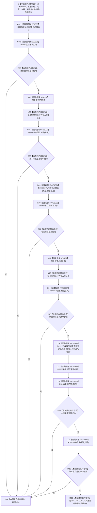

# CF-L10-0083 写入身份会话现状流程图

图类型：现状流程图
代码版本：`3920a74638264f9f539d50f32f3c9fe5fb1982ab`
当前工作区复核基线：`af74e46ef3fd0b1b2c108d695569855909a59ee1`
源码 blob：`16ac9534baeda26ac8a712066e713f3339f6e0c8`
覆盖文件：`海中鱼巣/领域/数据操作.需求任务方法.ixx:2768-2796`
唯一根函数：R0451
完整签名：`bool 海中鱼巣::需求任务方法数据操作::写入身份_会话(海中鱼巣::结构写入会话& 会话, 海中鱼巣::节点类型 类型, std::uint64_t 主键, 海中鱼巣::主信息句柄& 新主信息, 海中鱼巣::节点句柄& 新节点, 海中鱼巣::需求任务方法数据操作::固定故障控制* 故障 = nullptr) const`
参数：`会话`、`新主信息`、`新节点` 为调用方拥有的可写借用；`类型`、`主键` 按值传入；Debug|x64 下 `故障` 为可选调用期指针
返回结果：创建主信息候选、创建节点候选、绑定主键或任一固定故障写点失败时返回 `false`；全部步骤成功时返回 `true`
调用方：R0433（RCE1343）、R0455（RCE1409）
直接项目函数：R0021（RCE1393）、R0640（RCE3026）、R0845（RCE3027）、R0022（RCE1394）、R0641（RCE3028）、R0027（RCE1395）、R0129（RCE1396）、R0138（RCE3029）
符号外部边界：X04138—X04141
逐行映射表：`流程图/代码流程图/L10/CF-L10-0083_写入身份会话_逐行代码映射表.md`
依据提交 / 结构化消息：冻结源码提交 `3920a74638264f9f539d50f32f3c9fe5fb1982ab`；Debug|x64 工程定义 `HY_EGO_ENABLE_STRUCTURE_COMMIT_FAULT_SELF_TEST`；当前 `main` 复核目标源码零差异
验证输出：29 行源码完整映射；8 个项目出边、4 个外部边界、0 个未解析项目调用；本切片不运行构建或程序
依据：`规范/0050_项目通用机器逻辑与禁止性规则总纲_20260721.md`、`规范/0600_代码函数流程图应用与维护规范.md`、`规范/4010_子规范_统一仓库稳定句柄与通用关系索引边界.md`、`规范/4040_子规范_不透明结构事务候选确认撤销与最后发布.md`
不得作为施工许可：是
不得宣称：返回 `true` 已经发布节点、绑定已经对普通读取可见、固定故障返回已自动撤销会话，或本函数独立完成了事务确认和发布

## 流程图

## 当前边界与规范核对

- 本函数只向不透明结构会话追加未发布候选并回填候选句柄，不执行会话确认或最后发布。
- 任一失败都以 `false` 交给外层会话执行器收口；本函数自身没有撤销逻辑。
- Debug 固定故障点位于主信息、节点和主键绑定三个成功写点之后。
