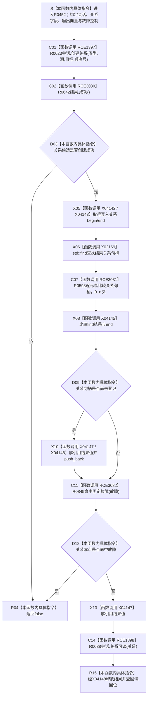

# CF-L10-0084 追加关系会话现状流程图

图类型：现状流程图
代码版本：`3920a74638264f9f539d50f32f3c9fe5fb1982ab`
当前工作区复核基线：`57866ac5ca63235ed12da60f635d29f1aacd718b`
源码 blob：`16ac9534baeda26ac8a712066e713f3339f6e0c8`
覆盖文件：`海中鱼巣/领域/数据操作.需求任务方法.ixx:2798-2818`
唯一根函数：R0452
完整签名：`bool 海中鱼巣::需求任务方法数据操作::追加关系_会话(海中鱼巣::结构写入会话& 会话, 海中鱼巣::关系类型 类型, 海中鱼巣::节点句柄 源节点, 海中鱼巣::节点句柄 目标节点, std::int64_t 顺序号, std::vector<海中鱼巣::关系句柄>& 写入关系, 海中鱼巣::需求任务方法数据操作::固定故障控制* 故障 = nullptr) const`
参数：`会话` 与 `写入关系` 为调用方拥有的可写借用；类型、源、目标、顺序号按值传入；Debug|x64 下 `故障` 为可选调用期指针
返回结果：创建关系失败或固定故障命中时返回 `false`；否则去重登记句柄并返回会话内关系可读结果
调用方：R0433（RCE1345）、R0453（RCE1399）
直接项目函数：R0023（RCE1397）、R0642（RCE3030）、R0598（RCE3031，`std::find` 逐元素回调）、R0845（RCE3032）、R0038（RCE1398）
符号外部边界：X02169（需精确化）、X04142—X04148
逐行映射表：`流程图/代码流程图/L10/CF-L10-0084_追加关系会话_逐行代码映射表.md`
依据提交 / 结构化消息：冻结源码提交 `3920a74638264f9f539d50f32f3c9fe5fb1982ab`；Debug|x64 工程定义 `HY_EGO_ENABLE_STRUCTURE_COMMIT_FAULT_SELF_TEST`；当前 `main` 复核目标源码零差异
验证输出：21 行源码完整映射；5 个项目出边、8 个外部边界、0 个未解析项目调用；本切片不运行构建或程序
依据：`规范/0050_项目通用机器逻辑与禁止性规则总纲_20260721.md`、`规范/0600_代码函数流程图应用与维护规范.md`、`规范/4010_子规范_统一仓库稳定句柄与通用关系索引边界.md`、`规范/4040_子规范_不透明结构事务候选确认撤销与最后发布.md`
不得作为施工许可：是
不得宣称：返回 `true` 已经发布关系、写入关系向量是权威关系账、固定故障返回已自动撤销会话，或 `std::find` 命中可以替代会话读回

## 流程图

## 当前边界与规范核对

- `写入关系` 仅是调用方用于后续读回或撤销核对的值式句柄清单，不是第二份权威关系账。
- `std::find` 的逐元素相等比较实际回调项目函数 R0598，既有 X02169 需精确到具体迭代器模板实例。
- 最终 `关系可读` 只检查当前会话视图；普通读取可见性仍等待外层事务最后发布。
