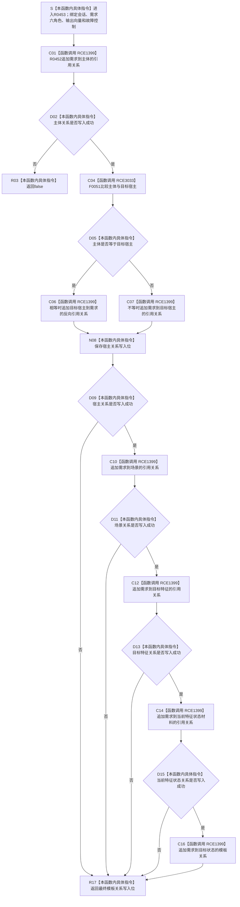

# CF-L10-0085 写入需求关系组会话现状流程图

图类型：现状流程图
代码版本：`3920a74638264f9f539d50f32f3c9fe5fb1982ab`
当前工作区复核基线：`57866ac5ca63235ed12da60f635d29f1aacd718b`
源码 blob：`16ac9534baeda26ac8a712066e713f3339f6e0c8`
覆盖文件：`海中鱼巣/领域/数据操作.需求任务方法.ixx:2820-2874`
唯一根函数：R0453
完整签名：`bool 海中鱼巣::需求任务方法数据操作::写入需求关系组_会话(海中鱼巣::结构写入会话& 会话, 海中鱼巣::节点句柄 需求, 海中鱼巣::节点句柄 主体, 海中鱼巣::节点句柄 目标宿主, 海中鱼巣::节点句柄 场景, 海中鱼巣::节点句柄 目标特征, 海中鱼巣::节点句柄 当前特征状态材料, 海中鱼巣::节点句柄 目标状态, std::vector<海中鱼巣::关系句柄>& 写入关系, 海中鱼巣::需求任务方法数据操作::固定故障控制* 故障 = nullptr) const`
参数：`会话` 与 `写入关系` 为调用方拥有的可写借用；七个节点句柄按值传入；Debug|x64 下 `故障` 为可选调用期指针
返回结果：按短路顺序写入六个需求角色关系；任一追加失败即返回 `false`，全部成功返回 `true`
调用方：R0455（RCE1410）
直接项目函数：R0452（RCE1399）、F0051（RCE3033）
符号外部边界：无
逐行映射表：`流程图/代码流程图/L10/CF-L10-0085_写入需求关系组会话_逐行代码映射表.md`
依据提交 / 结构化消息：冻结源码提交 `3920a74638264f9f539d50f32f3c9fe5fb1982ab`；Debug|x64 工程定义 `HY_EGO_ENABLE_STRUCTURE_COMMIT_FAULT_SELF_TEST`；当前 `main` 复核目标源码零差异
验证输出：55 行源码完整映射；2 个项目出边、0 个外部边界、0 个未解析项目调用；本切片不运行构建或程序
依据：`规范/0050_项目通用机器逻辑与禁止性规则总纲_20260721.md`、`规范/0600_代码函数流程图应用与维护规范.md`、`规范/3100_根规范_需求_20260720.md`、`规范/4040_子规范_不透明结构事务候选确认撤销与最后发布.md`
不得作为施工许可：是
不得宣称：返回 `true` 已经发布完整需求、主体等于宿主时关系方向可以任意解释，或任一短路失败已由本函数完成撤销

## 流程图

## 当前边界与规范核对

- 当主体等于目标宿主时，宿主角色使用 `目标宿主 -> 需求` 的反向引用；读取端 R0442 同时检查出边和来源边以恢复该角色。
- 六次关系写入严格短路，后续角色不会在前一角色失败后继续追加。
- 本函数只形成会话候选，最终发布与失败撤销均由外层结构写入执行器承担。
