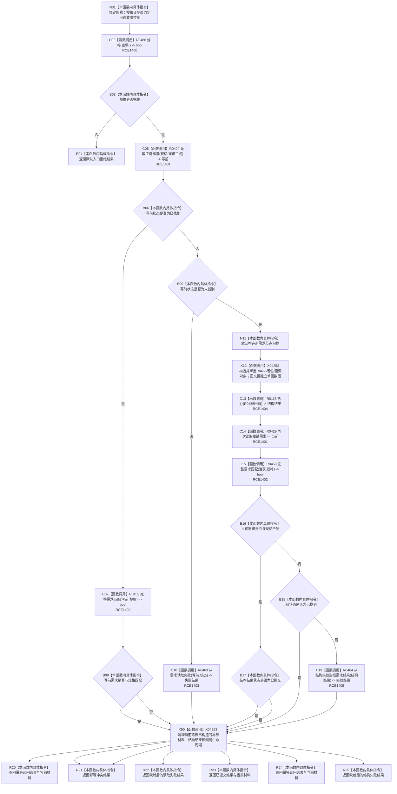

# CF-L10-0086 创建完整目标状态需求实现现状流程图

图类型：现状流程图
代码版本：`3920a74638264f9f539d50f32f3c9fe5fb1982ab`
源码 blob：`16ac9534baeda26ac8a712066e713f3339f6e0c8`
当前工作区复核基线：`af74e46ef3fd0b1b2c108d695569855909a59ee1`
覆盖文件：`海中鱼巣/领域/数据操作.需求任务方法.ixx:2876-2927`
唯一根函数：R0454
完整签名：`需求提交结果 海中鱼巣::需求任务方法数据操作::创建完整目标状态需求_实现(const 完整需求写入规格& 规格, 固定故障控制* 故障) const`
参数：`规格` 为只读借用；`故障` 仅在 `HY_EGO_ENABLE_STRUCTURE_COMMIT_FAULT_SELF_TEST` 启用时存在并按指针借用
返回结果：规格非法返回入口拒绝；已有同主键且匹配返回幂等读回，不匹配返回幂等冲突；新事务后按读回材料和结构结果返回已提交、幂等读回、幂等冲突或映射失败结果
已登记调用方：R0431（RCE1337）
直接项目函数：R0466（RCE1400）、R0429（RCE1401）、R0459（RCE1402）、R0463（RCE1403）、R0116（RCE1404）、R0464（RCE1405）
回调：RCB0020 把 R0455 交给 R0116；R0455 正文不在本图展开
外部边界：X04252—X04253
逐行映射表：`流程图/代码流程图/L10/CF-L10-0086_创建完整目标状态需求实现_逐行代码映射表.md`
结构读写：通过 R0116 调度 R0455 在结构写入会话中形成需求候选并请求提交；外层两次按主键读回裁决结果
逻辑内返回：入口规格拒绝、写前读取失败、幂等读回与幂等冲突
内部错误边界：结构执行后既不匹配也不存在冲突材料时由 R0464 映射结构失败
依据提交 / 结构化消息：当前维护基线 `57866ac5ca63235ed12da60f635d29f1aacd718b`；冻结源码提交 `3920a74638264f9f539d50f32f3c9fe5fb1982ab`
不得作为施工许可：是
不得宣称：返回已提交表示需求之外的目标状态或关系仍满足后续业务合同

## 流程图

## 当前边界

- R0454 只构造并传入 R0455 回调；2893—2916 的回调正文由 R0455 独立图逐行展开。
- 外层事务后总是再次读取主键需求，以当前读回材料优先裁决成功、幂等读回或冲突。
