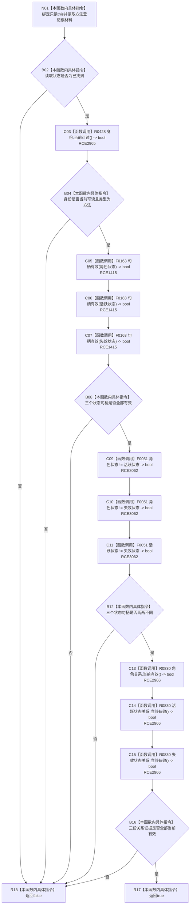

# CF-L10-0087 方法登记根材料完整现状流程图

图类型：现状流程图
代码版本：`3920a74638264f9f539d50f32f3c9fe5fb1982ab`
源码 blob：`16ac9534baeda26ac8a712066e713f3339f6e0c8`
当前工作区复核基线：`57866ac5ca63235ed12da60f635d29f1aacd718b`
覆盖文件：`海中鱼巣/领域/数据操作.需求任务方法.ixx:291-298`
唯一根函数：R0456
完整签名：`bool 海中鱼巣::方法登记根材料::完整() const noexcept`
参数：无显式参数；隐式 `this` 为只读借用
返回结果：读取状态、方法身份、三个状态节点句柄、句柄互异性和三份关系证据全部满足时返回 `true`，否则返回 `false`
已登记调用方：R0460（RCE1425）
直接项目函数：R0428（RCE2965）、F0163（RCE1415）、F0051（RCE3062）、R0830（RCE2966）
外部边界：无
逐行映射表：`流程图/代码流程图/L10/CF-L10-0087_方法登记根材料完整_逐行代码映射表.md`
结构读写：只读方法登记根材料字段；不访问仓库，不写机器结构
依据提交 / 结构化消息：当前维护基线 `57866ac5ca63235ed12da60f635d29f1aacd718b`；冻结源码提交 `3920a74638264f9f539d50f32f3c9fe5fb1982ab`
不得作为施工许可：是
不得宣称：返回 `true` 表示相关节点和关系仍是仓库当前事实

## 流程图

## 当前边界

- RCE3062 记录三个节点句柄 `!=` 表达式对 F0051 `operator==` 的 C++20 重写调用。
- 本函数只组合材料字段，不重新读取节点、状态或关系仓库。
