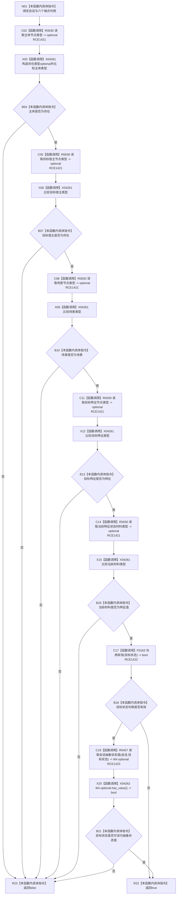

# CF-L10-0088 会话需求端点匹配现状流程图

图类型：现状流程图
代码版本：`3920a74638264f9f539d50f32f3c9fe5fb1982ab`
源码 blob：`16ac9534baeda26ac8a712066e713f3339f6e0c8`
当前工作区复核基线：`af74e46ef3fd0b1b2c108d695569855909a59ee1`
覆盖文件：`海中鱼巣/领域/数据操作.需求任务方法.ixx:3298-3313`
唯一根函数：R0458
完整签名：`bool 海中鱼巣::需求任务方法数据操作::会话需求端点匹配(结构写入会话& 会话, 节点句柄 主体, 节点句柄 目标宿主, 节点句柄 场景, 节点句柄 目标特征, 节点句柄 当前特征状态材料, 节点句柄 目标状态) const`
参数：`会话` 为可变借用但本函数只读；六个节点句柄按值传入，`目标状态` 可为空
返回结果：五个必选端点类型匹配，且目标状态为空或可读取抽象状态值时返回 `true`，否则返回 `false`
已登记调用方：R0455（RCE1406）
直接项目函数：R0030（RCE1421）、F0163（校正后的 RCE1422）、R0457（RCE1423）
外部边界：X04261—X04262
逐行映射表：`流程图/代码流程图/L10/CF-L10-0088_会话需求端点匹配_逐行代码映射表.md`
结构读写：只读会话候选节点类型、关系和主信息；不请求提交
依据提交 / 结构化消息：当前维护基线 `57866ac5ca63235ed12da60f635d29f1aacd718b`；冻结源码提交 `3920a74638264f9f539d50f32f3c9fe5fb1982ab`
不得作为施工许可：是
不得宣称：端点匹配表示需求关系组已写入或目标状态已发布

## 流程图

## 当前边界

- 原 RCE1422 误绑关系句柄重载 F0168；`目标状态` 静态类型为节点句柄，本批校正为 F0163。
- 空目标状态是当前函数明确允许的端点匹配分支。
