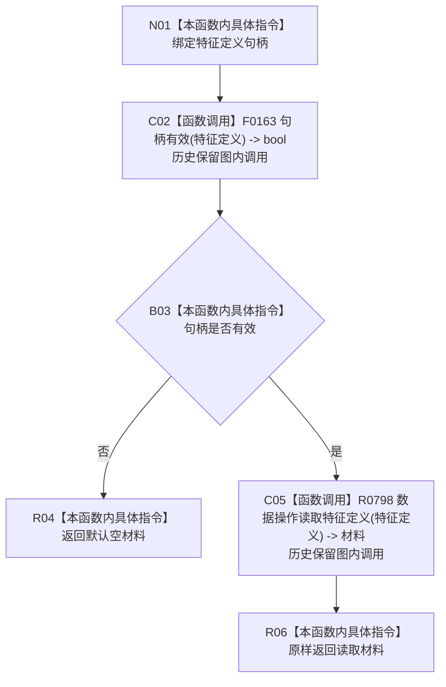

# CF-L10-0089 特征业务服务读取特征定义现状流程图

图类型：当前不可达历史保留现状流程图
代码版本：`0a93526882cb33c61c2fbb04ecad1aeaddcfe225`
当前工作区复核基线：`c3939fcd2fe13b6a5ba69e5dcad6efc519bdf667`
源码 blob：`7620a4c6316130cd8af546d69b9528fc696db5c3`
覆盖文件：`海中鱼巣/领域/服务.特征.ixx:232-235`
唯一根函数：R0504（当前不可达历史保留）
完整签名：`特征定义值式材料 海中鱼巣::特征业务服务::读取特征定义(节点句柄 特征定义) const`
参数：特征定义句柄值传入
返回结果：无效句柄返回默认空材料；有效句柄返回数据操作读取材料
历史图内实现调用：F0163、R0798；不进入当前可达边表
逐行映射表：`流程图/代码流程图/L10/CF-L10-0089_特征业务服务读取特征定义_逐行代码映射表.md`
不得作为施工许可：是
不得宣称：返回材料必然完整

## 流程图

## 关键边界

- 本函数零结构写入；R0798 的读取与材料状态由其独立图承载。
