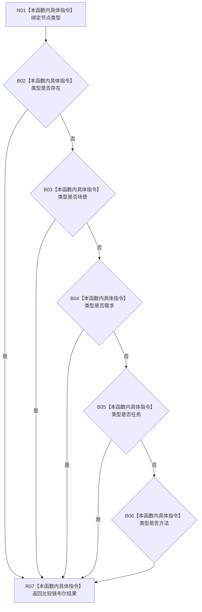

# CF-L10-0090 特征业务服务允许特征宿主现状流程图

图类型：现状流程图
代码版本：`0a93526882cb33c61c2fbb04ecad1aeaddcfe225`
当前工作区复核基线：`c3939fcd2fe13b6a5ba69e5dcad6efc519bdf667`
源码 blob：`7620a4c6316130cd8af546d69b9528fc696db5c3`
覆盖文件：`海中鱼巣/领域/服务.特征.ixx:267-271`
唯一根函数：R0505
完整签名：`static bool 海中鱼巣::特征业务服务::允许特征宿主(节点类型 类型) noexcept`
参数：节点类型枚举值传入
返回结果：存在、场景、需求、任务或方法返回 true，其它类型返回 false
直接项目函数：无
逐行映射表：`流程图/代码流程图/L10/CF-L10-0090_特征业务服务允许特征宿主_逐行代码映射表.md`
不得作为施工许可：是
不得宣称：当前允许集合自动成为新的规范枚举

## 流程图

## 关键边界

- 本函数为纯枚举比较，无结构读写。
