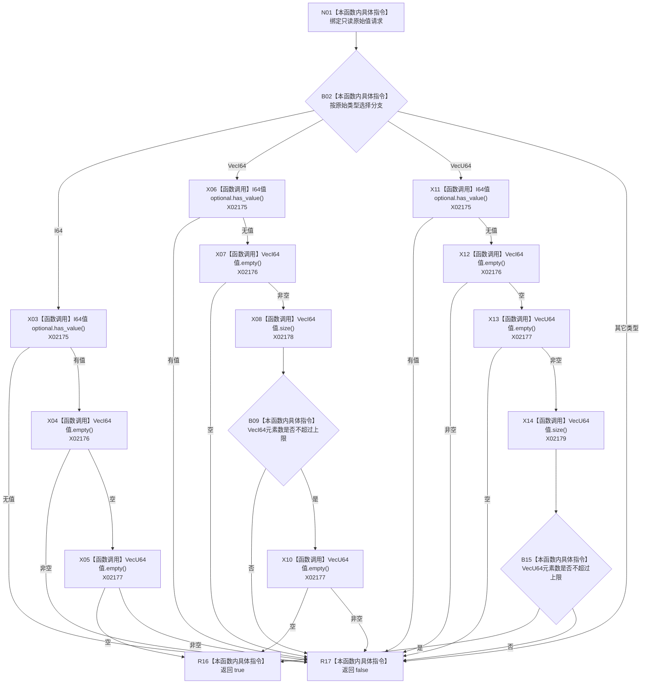

# CF-L10-0091 特征业务服务原始值字段自洽现状流程图

图类型：现状流程图
代码版本：`0a93526882cb33c61c2fbb04ecad1aeaddcfe225`
当前工作区复核基线：`c3939fcd2fe13b6a5ba69e5dcad6efc519bdf667`
源码 blob：`7620a4c6316130cd8af546d69b9528fc696db5c3`
覆盖文件：`海中鱼巣/领域/服务.特征.ixx:273-288`
唯一根函数：R0506
完整签名：`static bool 海中鱼巣::特征业务服务::原始值字段自洽(const 初始特征原始值请求& 请求) noexcept`
参数：`请求` 为调用期只读借用
返回结果：所选原始类型仅由对应字段承载且序列不超过上限时返回 true，否则返回 false
已登记调用方：R0503（RCE1511）
直接项目函数：无
外部边界：X02175—X02179
逐行映射表：`流程图/代码流程图/L10/CF-L10-0091_特征业务服务原始值字段自洽_逐行代码映射表.md`
不得作为施工许可：是
不得宣称：字段自洽等于特征值已经写入或发布

## 流程图

## 关键边界

- 三种受支持类型都按源码短路顺序检查互斥字段；本函数只读请求，不改变任何项目结构。
