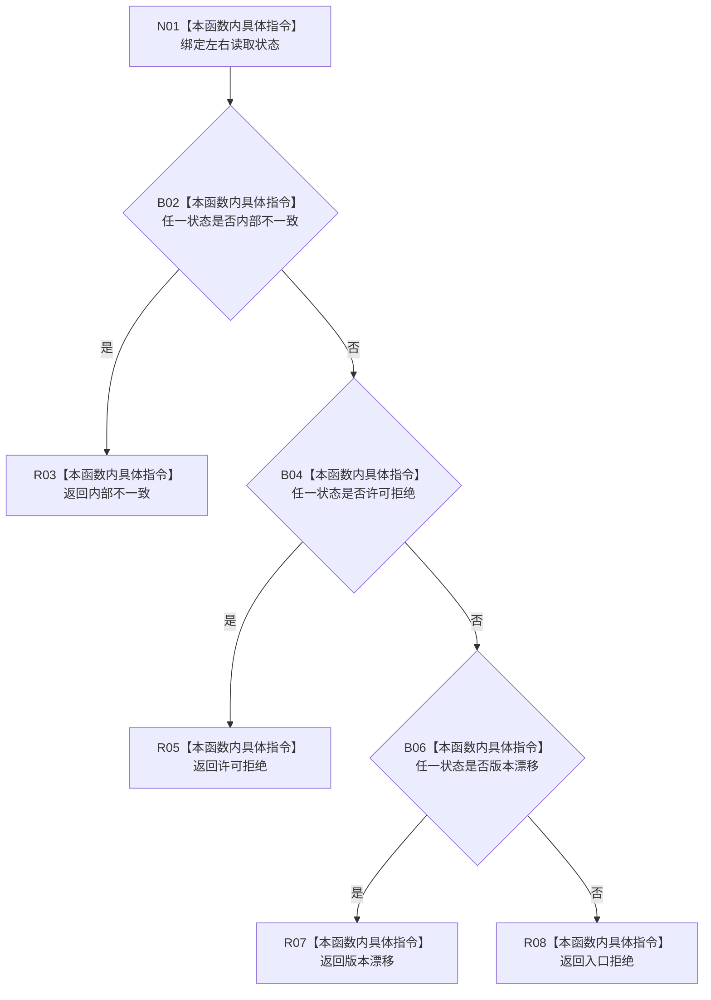

# CF-L10-0092 特征业务服务合并读取失败现状流程图

图类型：现状流程图
代码版本：`0a93526882cb33c61c2fbb04ecad1aeaddcfe225`
当前工作区复核基线：`c3939fcd2fe13b6a5ba69e5dcad6efc519bdf667`
源码 blob：`7620a4c6316130cd8af546d69b9528fc696db5c3`
覆盖文件：`海中鱼巣/领域/服务.特征.ixx:290-300`
唯一根函数：R0507
完整签名：`static 特征规格状态 海中鱼巣::特征业务服务::合并读取失败(特征体系读取状态 左, 特征体系读取状态 右) noexcept`
参数：左右两个读取状态枚举值传入
返回结果：按内部不一致、许可拒绝、版本漂移的优先顺序映射；均未命中时返回入口拒绝
已登记调用方：R0502（RCE1508）
直接项目函数：无
逐行映射表：`流程图/代码流程图/L10/CF-L10-0092_特征业务服务合并读取失败_逐行代码映射表.md`
不得作为施工许可：是
不得宣称：映射后的状态已经触发任何结构补偿

## 流程图

## 关键边界

- 本函数为纯枚举优先级映射，无结构读取或写入。
