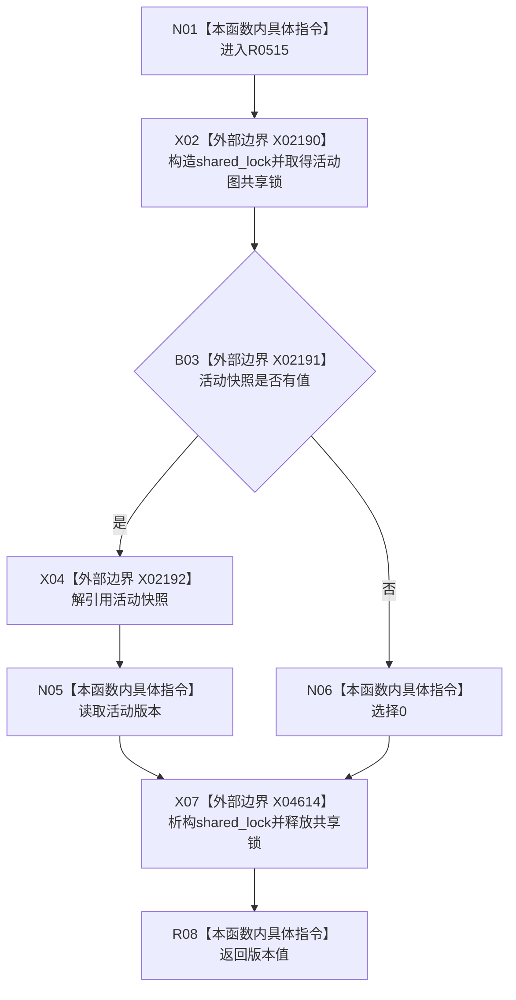

# CF-L10-0093 概念图服务读取活动图版本现状流程图

图类型：现状流程图
代码版本：`0a93526882cb33c61c2fbb04ecad1aeaddcfe225`
工作区复核基线：`c3939fcd2fe13b6a5ba69e5dcad6efc519bdf667`（目标源码相对代码版本零差异）
源码 blob：`dc4bd08f99622b3380c91dd15258fc8ab2e1b9c6`
覆盖文件：`海中鱼巣/领域/概念图服务.h:1536-1539`
唯一根函数：R0515
完整签名：`std::uint64_t 海中鱼巣::概念图服务::读取活动图版本() const`
参数：无显式参数；只读当前服务的 `活动快照_`
返回结果：存在活动快照时返回其活动版本，否则返回 `0`
已登记调用方：R0321（RCE1018，`控制面板服务.h:767`）
直接项目函数：无
外部边界：X02190—X02192、X04614（`shared_lock` 析构）
逐行映射表：`流程图/代码流程图/L10/CF-L10-0093_概念图服务读取活动图版本_逐行代码映射表.md`
结构读写：持有共享锁期间只读活动快照可选值和版本
不得作为施工许可：是
不得宣称：非零版本代表活动图业务内容完整或已经通过运行验收

## 流程图

## 当前边界

- 返回表达式在共享锁保护下求值，局部锁对象在真正返回前析构。
- `shared_lock` 析构已登记为 X04614；返回前释放共享读许可。
