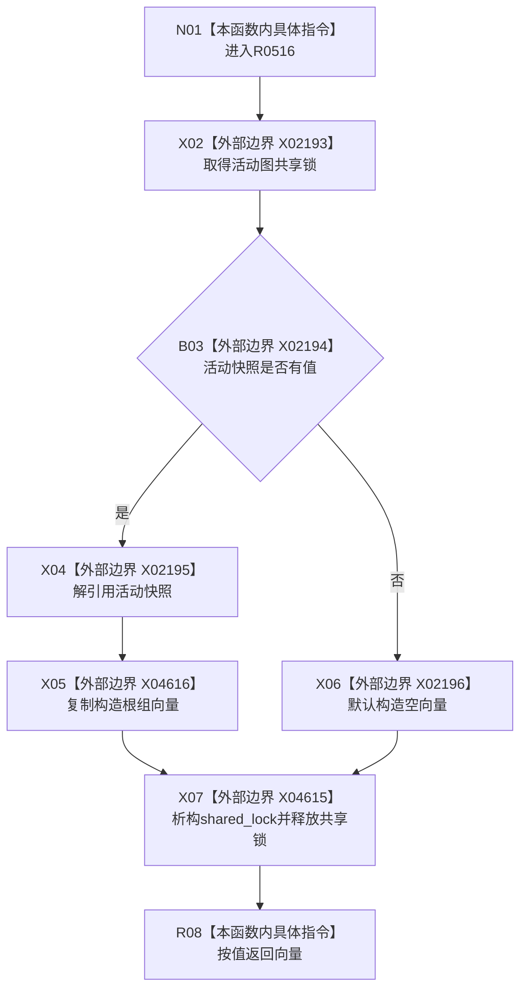

# CF-L10-0094 概念图服务读取活动概念根组现状流程图

图类型：现状流程图
代码版本：`0a93526882cb33c61c2fbb04ecad1aeaddcfe225`
工作区复核基线：`c3939fcd2fe13b6a5ba69e5dcad6efc519bdf667`
源码 blob：`dc4bd08f99622b3380c91dd15258fc8ab2e1b9c6`
覆盖文件：`海中鱼巣/领域/概念图服务.h:1541-1544`
唯一根函数：R0516
完整签名：`std::vector<海中鱼巣::节点句柄> 海中鱼巣::概念图服务::读取活动概念根组() const`
参数：无显式参数；只读当前服务的 `活动快照_`
返回结果：快照存在时复制返回根组，否则返回空向量
已登记调用方：R0321（RCE1020，`控制面板服务.h:769`）
直接项目函数：无
外部边界：X02193—X02196、X04615—X04616
逐行映射表：`流程图/代码流程图/L10/CF-L10-0094_概念图服务读取活动概念根组_逐行代码映射表.md`
结构读写：持共享锁复制根组，不返回内部容器引用
不得作为施工许可：是
不得宣称：返回非空根组代表每个根身份或关系均符合规范

## 流程图

## 当前边界

- 有值分支复制 `根组`，调用方不持有活动快照内部容器引用。
- 向量复制构造与共享锁析构分别登记为 X04616、X04615。
