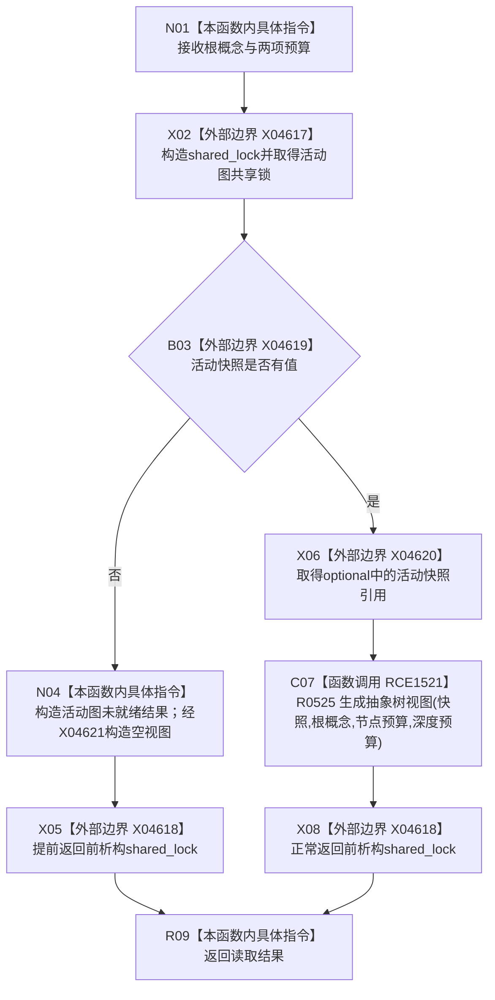

# CF-L10-0095 概念图服务读取抽象树视图并返回结果现状流程图

图类型：现状流程图
代码版本：`0a93526882cb33c61c2fbb04ecad1aeaddcfe225`
工作区复核基线：`c3939fcd2fe13b6a5ba69e5dcad6efc519bdf667`
源码 blob：`dc4bd08f99622b3380c91dd15258fc8ab2e1b9c6`
覆盖文件：`海中鱼巣/领域/概念图服务.h:2430-2439`
唯一根函数：R0517
完整签名：`海中鱼巣::抽象树读取结果 海中鱼巣::概念图服务::读取抽象树视图并返回结果(海中鱼巣::节点句柄 根概念, std::size_t 节点预算 = 4096, std::size_t 深度预算 = 128) const`
参数：根概念按值；节点预算和深度预算按值，默认值仅在调用方省略实参时使用
返回结果：活动图未就绪时返回具名状态和空视图；否则返回 R0525 的完整结果
已登记调用方：R0321（RCE1027，`控制面板服务.h:829`）
直接项目函数：R0525（RCE1521）
外部边界：共享锁、optional 与 RAII 边界为 X04617—X04621
逐行映射表：`流程图/代码流程图/L10/CF-L10-0095_概念图服务读取抽象树视图并返回结果_逐行代码映射表.md`
结构读写：在同一共享锁作用域内判断并读取一份活动快照，再同步生成视图
不得作为施工许可：是
不得宣称：已生成视图代表活动图的规范正确性或业务验收完成

## 流程图

## 当前边界

- R0525 在活动图共享锁仍持有时执行，因此它读取的快照引用在整个生成过程保持受保护。
- 未就绪是本函数允许的逻辑内结果；R0525 的内部错误状态不在本图中改写。
