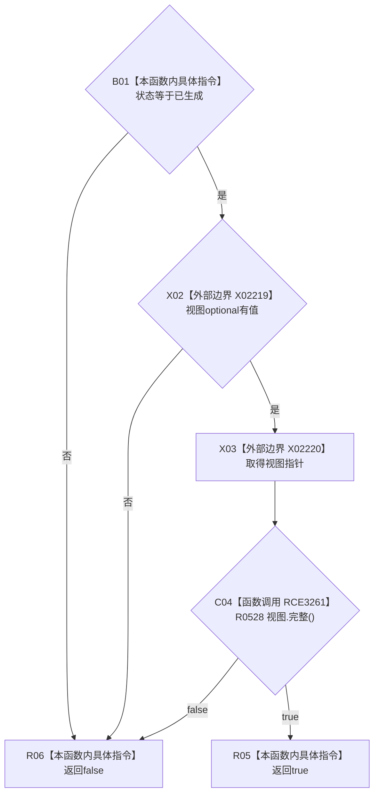

# CF-L10-0096 抽象树读取结果正常成功现状流程图

图类型：现状流程图
代码版本：`0a93526882cb33c61c2fbb04ecad1aeaddcfe225`
工作区复核基线：`2089268fbb3833ebc77486169b98d8a14c49d508`
源码 blob：`dc4bd08f99622b3380c91dd15258fc8ab2e1b9c6`
覆盖文件：`海中鱼巣/领域/概念图服务.h:759-763`
唯一根函数：R0530
完整签名：`bool 海中鱼巣::抽象树读取结果::正常成功() const`
参数：无显式参数；只读当前抽象树读取结果
返回结果：状态为已生成、视图有值且该视图完整时返回 `true`，否则按 `&&` 短路返回 `false`
已登记调用方：R0321（RCE1028）
直接项目函数：R0528（RCE3261）
外部边界：X02219、X02220
逐行映射表：`流程图/代码流程图/L10/CF-L10-0096_抽象树读取结果正常成功_逐行代码映射表.md`
结构读写：只读结果状态和可选视图
不得作为施工许可：是
不得宣称：返回成功代表抽象树内容符合规范或经过运行验收

## 流程图

## 当前边界

- `&&` 保证状态不是已生成或 optional 无值时不会解引用视图。
- R0530 到 R0528 的直接成员调用已登记为 RCE3261，并把 R0528 的最短深度更新为 L11。
