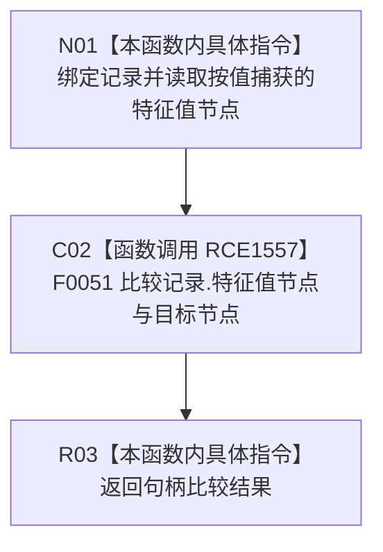

# CF-L10-0097 查找Vec记录已加锁只读匹配谓词现状流程图

图类型：现状流程图
代码版本：`0a93526882cb33c61c2fbb04ecad1aeaddcfe225`
工作区复核基线：`2089268fbb3833ebc77486169b98d8a14c49d508`
源码 blob：`be8c82c78253b3bc7d3f4aa15a93660e0025bb06`
覆盖文件：`海中鱼巣/领域/特征值服务.h:680-682`
唯一根函数：R0549
完整签名：`bool 海中鱼巣::特征值服务::查找Vec记录_已加锁(海中鱼巣::节点句柄 特征值节点) const::<lambda@特征值服务.h:680>::operator()(const 海中鱼巣::特征值服务::Vec原始值记录& 记录) const`
参数：`记录` 以 const 引用借用；闭包按值捕获 `特征值节点`
返回结果：记录节点句柄与目标节点句柄相等时返回 `true`，否则返回 `false`
已登记调用方：R0548（RCE1556；RCB0023）
直接项目函数：F0051（RCE1557）
外部边界：无
逐行映射表：`流程图/代码流程图/L10/CF-L10-0097_查找Vec记录已加锁只读匹配谓词_逐行代码映射表.md`
结构读写：只读记录节点句柄和闭包捕获值
不得作为施工许可：是
不得宣称：匹配记录唯一、记录内部一致或迭代器有效

## 流程图

## 当前边界

- `std::find_if` 由 R0548 调用并已有 X02230；本 lambda 只执行 RCE1557 的节点句柄比较。
- 正式外部边界表未把父函数的 `std::find_if` 调用重复归入本 lambda。
