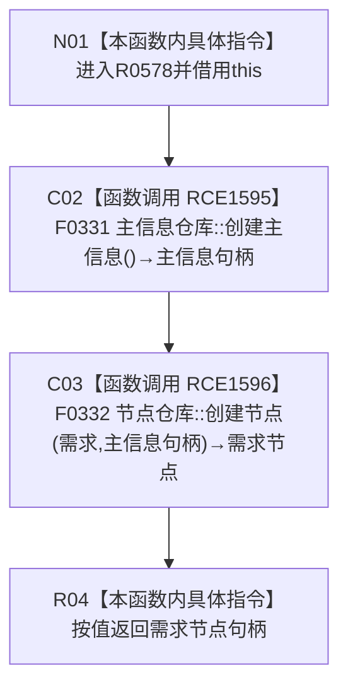

# CF-L10-0101 需求服务创建需求现状流程图

图类型：现状流程图
代码版本：`03a8b7ac099ccea83e57f2696e2290b7bcdfacaf`
工作区复核基线：`7edb47f7b58aa71a10c225790e41f1d6c12a0cbd`
源码 blob：`e41b0c665b360232e55ede728f2a4d561c5c9d32`
覆盖文件：`海中鱼巣/领域/需求服务.h:131-133`
唯一根函数：R0578
完整签名：`节点句柄 海中鱼巣::需求服务::创建需求()`
参数：无显式参数；隐式 `this` 为调用期间有效的非拥有借用
返回结果：先创建主信息，再以需求类型和该主信息创建节点，按值返回节点句柄
已登记调用方：R0579（RCE1601）
直接项目函数：F0331（RCE1595，无令牌 `主信息仓库::创建主信息()`）、F0332（RCE1596，无令牌 `节点仓库::创建节点(节点类型,主信息句柄)`）
外部边界：无
逐行映射表：`流程图/代码流程图/L10/CF-L10-0101_需求服务创建需求_逐行代码映射表.md`
结构读写：委托主信息仓库创建主信息，再委托节点仓库创建需求节点
逻辑内返回：无显式入口拒绝；被调函数返回的句柄不在本函数内复核
内部错误：本函数无追根因分支
生命周期与资源释放：主信息句柄作为嵌套调用结果传入节点创建，节点句柄按值返回
不得作为施工许可：是
不得宣称：返回句柄有效、两次创建具有同一事务原子性或需求承接关系已经建立

## 流程图

## 当前边界

- 第 132 行是嵌套调用：F0331 必须先形成主信息句柄，F0332 才能接收该实参。
- 两个调用均为无令牌重载；本函数没有显式结构事务令牌、回滚或读回。
- 本函数只创建节点本体，不写需求主体、目标宿主、场景、特征或目标状态关系。
