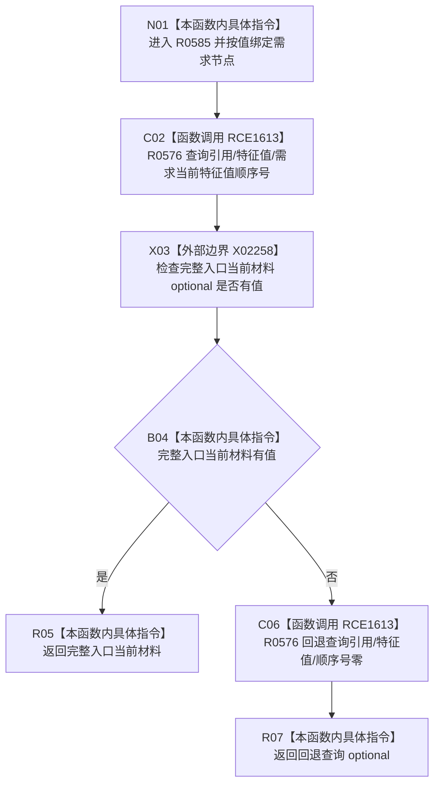

# CF-L10-0102 读取需求当前特征状态材料现状流程图

图类型：现状流程图
代码版本：`03a8b7ac099ccea83e57f2696e2290b7bcdfacaf`
工作区复核基线：`7edb47f7b58aa71a10c225790e41f1d6c12a0cbd`
源码 blob：`e41b0c665b360232e55ede728f2a4d561c5c9d32`
覆盖文件：`海中鱼巣/领域/需求服务.h:551-558`
唯一根函数：R0585
完整签名：`std::optional<节点句柄> 海中鱼巣::需求服务::读取需求当前特征状态材料(节点句柄 需求节点) const`
参数：`需求节点` 按值传入
返回结果：优先返回需求当前特征值顺序号下的特征值目标；该查询无值时回退查询顺序号零并返回结果
已登记调用方：R0286（RCE0922）、R0579（RCE1604）
直接项目函数：R0576（RCE1613，两个调用点）
外部边界：X02258 `std::optional<节点句柄>::has_value()`
逐行映射表：`流程图/代码流程图/L10/CF-L10-0102_读取需求当前特征状态材料_逐行代码映射表.md`
结构读写：本函数不直接写结构；两次下沉到 R0576 读取需求节点的引用关系
不得作为施工许可：是
不得宣称：返回特征值句柄代表特征状态材料完整、句柄内容有效或业务能力已完成

## 流程图

## 当前边界

- 只有首个查询返回空 optional 才执行顺序号零回退；首个查询有值时不会继续回退。
- 本函数不比较两个候选，也不验证特征值节点的业务内容；唯一性与类型判断由 R0576 决定。
