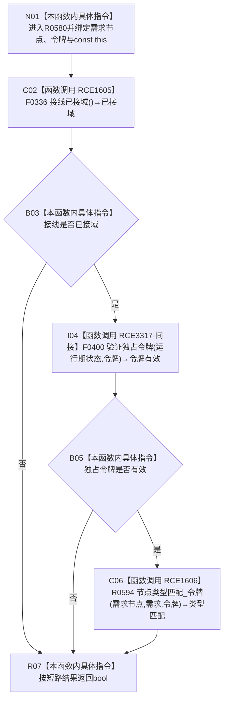

# CF-L10-0103 需求是否有效令牌现状流程图

图类型：现状流程图
代码版本：`03a8b7ac099ccea83e57f2696e2290b7bcdfacaf`
工作区复核基线：`7edb47f7b58aa71a10c225790e41f1d6c12a0cbd`
源码 blob：`e41b0c665b360232e55ede728f2a4d561c5c9d32`
覆盖文件：`海中鱼巣/领域/需求服务.h:348-351`
唯一根函数：R0580
完整签名：`bool 海中鱼巣::需求服务::需求是否有效(节点句柄 需求节点,const 结构事务令牌& 令牌) const`
参数：`需求节点` 按值传入；`令牌` 为调用期间有效的只读非拥有借用；隐式 const `this` 为非拥有借用
返回结果：接线已接域、函数指针验证独占令牌成功且需求节点在该令牌下类型匹配时返回 `true`，否则按短路结果返回 `false`
已登记调用方：R0283（RCE0906）、R0286（RCE0914）
直接项目函数：F0336（RCE1605）、F0400（RCE3317，经接线函数指针间接调用）、R0594（RCE1606）
间接边界：RCE3317 解析到 F0400 `结构事务协调器::生成接线()` 内的独占令牌验证 lambda
逐行映射表：`流程图/代码流程图/L10/CF-L10-0103_需求是否有效令牌_逐行代码映射表.md`
结构读写：只读接线状态、令牌有效性和令牌视图下的节点类型
逻辑内返回：任一条件不成立时返回 `false`
内部错误：本函数无写后异常分支
生命周期与资源释放：无拥有资源；令牌与接线均只借用
不得作为施工许可：是
不得宣称：返回 `true` 证明需求承接材料完整、令牌属于当前调用方或业务可执行

## 流程图

## 当前边界

- 三个条件按 `&&` 从左到右短路；接线未接域时不会调用令牌验证，令牌无效时不会读取节点类型。
- `验证独占令牌` 是接线结构中的函数指针调用，不是具名成员函数。
- 本函数只返回组合布尔结果，不区分接线未接、令牌无效和节点类型不符。
