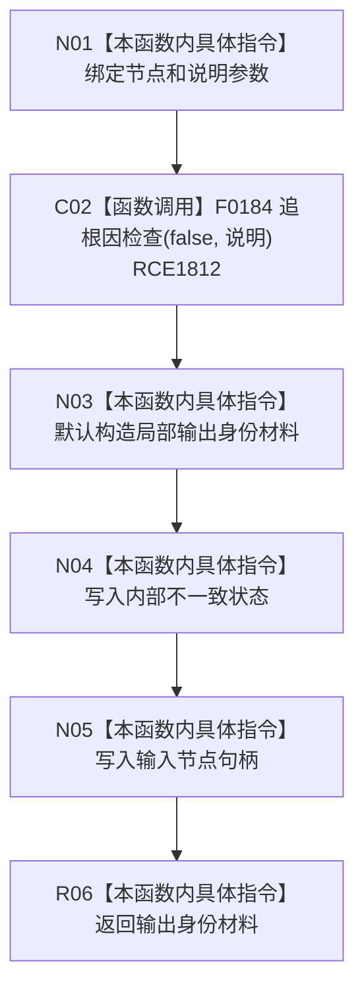

# CF-L10-0104 身份内部不一致现状流程图

图类型：现状流程图
代码版本：`03a8b7ac099ccea83e57f2696e2290b7bcdfacaf`
当前工作区复核基线：`7cbd2167eb5f6d495f48657a0e5badb07c52a358`
源码 blob：`524922ab2f3d0d76cfed4bdd517f0d7d57e1ae6a`
覆盖文件：`海中鱼巣/领域/数据操作.存在场景.ixx:483-489`
唯一根函数：R0631
完整签名：`海中鱼巣::节点身份材料 海中鱼巣::存在场景数据操作::身份内部不一致(海中鱼巣::节点句柄 节点, const wchar_t* 说明) const`
参数：`节点` 按值输入；`说明` 为调用方持有的只读宽字符串指针
返回结果：返回状态为内部不一致、节点为输入节点的身份材料
调用图：`流程图/主程序可达调用关系/01_main可达项目调用边表.md`
输入契约 / 调用语境表：本图“当前边界”节；未另建独立表
非成功返回二分审查表：本图返回节点与“当前边界”节；未另建独立表
偏差清单：无 / 不适用；本图只登记当前实现事实
依据提交 / 结构化消息：源码冻结 `03a8b7ac099ccea83e57f2696e2290b7bcdfacaf`；无结构化执行消息
验证输出：配对逐行映射、节点集合、源码 blob 与本批机械审计
已登记调用方：R0630（RCE1808）
直接项目函数：F0184（RCE1812）
外部边界：无
逐行映射表：`流程图/代码流程图/L10/CF-L10-0104_身份内部不一致_逐行代码映射表.md`
结构读写：发出追根因诊断并只写局部结果材料，不修改仓库结构
不得作为施工许可：是
不得宣称：诊断调用改变机器事实，或内部不一致已经修复

## 流程图

## 当前边界

- F0184 的返回值被显式丢弃；诊断不参与后续材料状态裁决。
