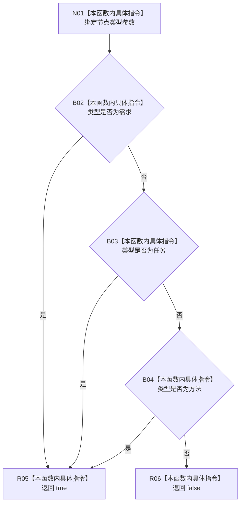

# CF-L10-0105 是来源类型现状流程图

图类型：现状流程图
代码版本：`03a8b7ac099ccea83e57f2696e2290b7bcdfacaf`
当前工作区复核基线：`7cbd2167eb5f6d495f48657a0e5badb07c52a358`
源码 blob：`524922ab2f3d0d76cfed4bdd517f0d7d57e1ae6a`
覆盖文件：`海中鱼巣/领域/数据操作.存在场景.ixx:413-415`
唯一根函数：R0632
完整签名：`bool 海中鱼巣::存在场景数据操作::是来源类型(海中鱼巣::节点类型 类型) noexcept`
参数：`类型` 按值输入
返回结果：需求、任务或方法返回 `true`；其它类型返回 `false`
调用图：`流程图/主程序可达调用关系/01_main可达项目调用边表.md`
输入契约 / 调用语境表：本图“当前边界”节；未另建独立表
非成功返回二分审查表：本图返回节点与“当前边界”节；未另建独立表
偏差清单：无 / 不适用；本图只登记当前实现事实
依据提交 / 结构化消息：源码冻结 `03a8b7ac099ccea83e57f2696e2290b7bcdfacaf`；无结构化执行消息
验证输出：配对逐行映射、节点集合、源码 blob 与本批机械审计
已登记调用方：R0630（RCE1810）
直接项目函数：无
外部边界：无
逐行映射表：`流程图/代码流程图/L10/CF-L10-0105_是来源类型_逐行代码映射表.md`
结构读写：只比较值式枚举，不修改结构
不得作为施工许可：是
不得宣称：返回 `true` 能证明对应节点句柄当前可读或来源关系有效

## 流程图

## 当前边界

- 判断保持 C++ `||` 的从左到右短路顺序：需求、任务、方法。
