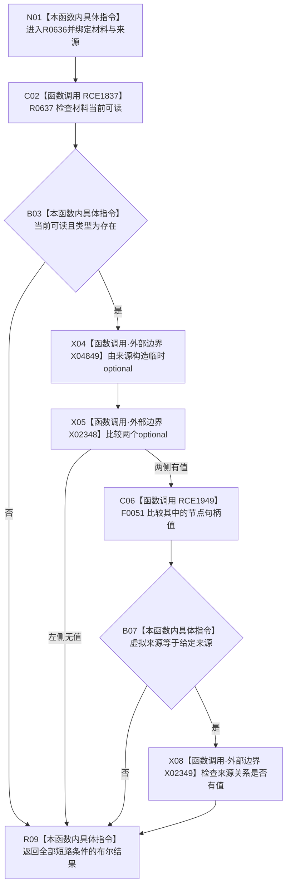

# CF-L10-0106 存在场景是虚拟存在现状流程图

图类型：现状流程图
代码版本：`03a8b7ac099ccea83e57f2696e2290b7bcdfacaf`
工作区复核基线：`7cbd2167eb5f6d495f48657a0e5badb07c52a358`
源码 blob：`524922ab2f3d0d76cfed4bdd517f0d7d57e1ae6a`
覆盖文件：`海中鱼巣/领域/数据操作.存在场景.ixx:422-426`
唯一根函数：R0636
完整签名：`bool 海中鱼巣::存在场景数据操作::是虚拟存在(const 海中鱼巣::节点身份材料& 材料, 海中鱼巣::节点句柄 来源) noexcept`
参数：`材料` 为非拥有只读借用；`来源` 按值传入
返回结果：材料当前可读、类型为存在、虚拟来源等于给定来源且来源关系有值时返回 `true`，否则返回 `false`
调用图：`流程图/主程序可达调用关系/01_main可达项目调用边表.md`
输入契约 / 调用语境表：本图“当前边界”节；未另建独立表
非成功返回二分审查表：本图返回节点与“当前边界”节；未另建独立表
偏差清单：无 / 不适用；本图只登记当前实现事实
依据提交 / 结构化消息：源码冻结 `03a8b7ac099ccea83e57f2696e2290b7bcdfacaf`；无结构化执行消息
验证输出：配对逐行映射、节点集合、源码 blob 与本批机械审计
已登记调用方：R0633（RCE1819）
直接项目函数：R0637（RCE1837）、F0051（RCE1949）
外部边界：X04849（临时 optional 构造）、X02348（optional 相等）、X02349（来源关系 `has_value()`）
逐行映射表：`流程图/代码流程图/L10/CF-L10-0106_存在场景是虚拟存在_逐行代码映射表.md`
结构读写：只读材料，不修改结构
逻辑内返回：任一短路条件不成立时返回 `false`
内部错误：本函数无独立内部错误分支
生命周期与资源释放：第 424 行临时 optional 在完整表达式结束后释放；节点句柄为按值局部
不得作为施工许可：是
不得宣称：返回 `true` 等于来源关系内容或持久状态已经完整读回

## 流程图

## 当前边界

- 第 423—425 行按 `&&` 从左到右短路；材料不可读或类型不符时不构造临时 optional。
- RCE1949 是 optional 相等在两侧均有值时委托的项目节点句柄比较；X02348 仍保留标准库 optional 运算边界。
