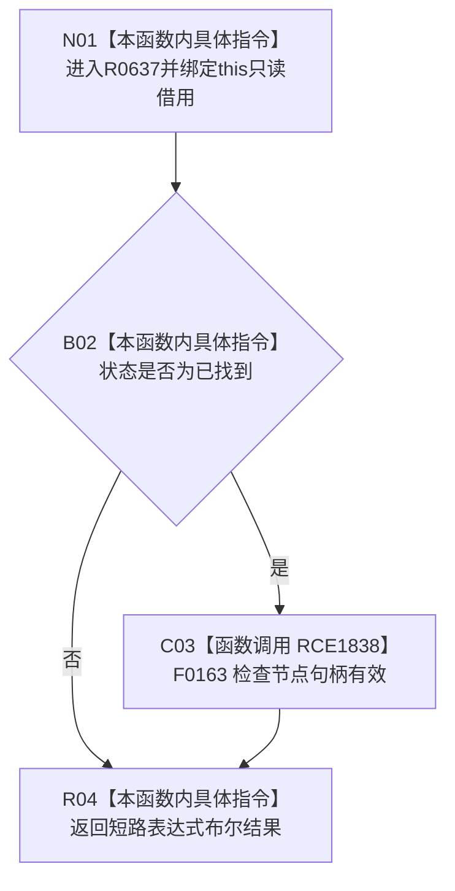

# CF-L10-0107 节点身份材料当前可读现状流程图

图类型：现状流程图
代码版本：`03a8b7ac099ccea83e57f2696e2290b7bcdfacaf`
工作区复核基线：`7cbd2167eb5f6d495f48657a0e5badb07c52a358`
源码 blob：`524922ab2f3d0d76cfed4bdd517f0d7d57e1ae6a`
覆盖文件：`海中鱼巣/领域/数据操作.存在场景.ixx:62-64`
唯一根函数：R0637
完整签名：`bool 海中鱼巣::节点身份材料::当前可读() const noexcept`
参数：隐式 `this` 为调用期间有效的非拥有只读借用
返回结果：状态为已找到且节点句柄有效时返回 `true`，否则返回 `false`
调用图：`流程图/主程序可达调用关系/01_main可达项目调用边表.md`
输入契约 / 调用语境表：本图“当前边界”节；未另建独立表
非成功返回二分审查表：本图返回节点与“当前边界”节；未另建独立表
偏差清单：无 / 不适用；本图只登记当前实现事实
依据提交 / 结构化消息：源码冻结 `03a8b7ac099ccea83e57f2696e2290b7bcdfacaf`；无结构化执行消息
验证输出：配对逐行映射、节点集合、源码 blob 与本批机械审计
已登记调用方：R0635（RCE1836）、R0636（RCE1837）
直接项目函数：F0163（RCE1838）
外部边界：无
逐行映射表：`流程图/代码流程图/L10/CF-L10-0107_节点身份材料当前可读_逐行代码映射表.md`
结构读写：只读当前对象字段
逻辑内返回：状态不是已找到或节点句柄无效时返回 `false`
内部错误：本函数无独立内部错误分支
生命周期与资源释放：无资源获取
不得作为施工许可：是
不得宣称：节点有效等于材料的其它字段或持久结构完整

## 流程图

## 当前边界

- 第 63 行按 `&&` 短路；状态不是已找到时不调用 F0163。
- 本函数只组合状态枚举与句柄有效性，不检查类型、来源或关系材料。
