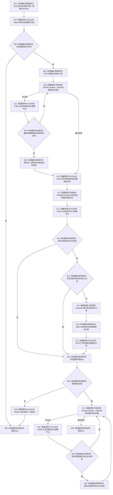

# CF-L10-0108 结构写入会话主键绑定匹配双参数现状流程图

图类型：现状流程图
代码版本：`03a8b7ac099ccea83e57f2696e2290b7bcdfacaf`
工作区复核基线：`7cbd2167eb5f6d495f48657a0e5badb07c52a358`
源码 blob：`df70de9c299c74f7f0766a3e94facaf504f57968`
覆盖文件：`海中鱼巣/核心/会话.结构写入.ixx:606-630`
唯一根函数：R0638
完整签名：`bool 海中鱼巣::结构写入会话::主键绑定匹配(std::uint64_t 主键, 海中鱼巣::节点句柄 预期节点)`
参数：`主键`、`预期节点` 按值传入；隐式 `this` 为非拥有可变借用并拥有会话写集与事务令牌的访问权
返回结果：仅当前线程可访问、仓库记录存在且节点匹配，并且存在会话写入记录时完整绑定记录也匹配，才标记对应写集已读回并返回 `true`；否则返回 `false`
调用图：`流程图/主程序可达调用关系/01_main可达项目调用边表.md`
输入契约 / 调用语境表：本图“当前边界”节；未另建独立表
非成功返回二分审查表：本图返回节点与“当前边界”节；未另建独立表
偏差清单：无 / 不适用；本图只登记当前实现事实
依据提交 / 结构化消息：源码冻结 `03a8b7ac099ccea83e57f2696e2290b7bcdfacaf`；无结构化执行消息
验证输出：配对逐行映射、节点集合、源码 blob 与本批机械审计
已登记调用方：R0634（RCE1833）、R0656（RCE1943）、R0678（RCE1992）、R0696（RCE2057）、R0358（RCE2164）、R0359（RCE2165）、R0405（RCE2166）、R0414（RCE2167）、R0433（RCE2168）、R0455（RCE2169）、R0785（RCE2704）
直接项目函数：R0043（RCE1839）、F0051（RCE1840，三处）、R0124（RCE1841）、R0127（RCE1842）、R0052（RCE1843）
外部边界：X02481（两次范围循环的非 const iterator `begin/end`）、X04850—X04852（两次范围循环的 iterator 比较、解引用、递增）、X02482—X02484（当前记录 optional 检查、箭头与解引用）
逐行映射表：`流程图/代码流程图/L10/CF-L10-0108_结构写入会话主键绑定匹配双参数_逐行代码映射表.md`
结构读写：只读索引仓库当前绑定记录；成功时把匹配写集项的 `已读回` 标记为 `true`；失败时写入会话失败结果
逻辑内返回：当前线程不可访问或绑定不匹配时返回 `false`
内部错误：绑定不匹配经 R0052 记录为结构写入内部不一致
生命周期与资源释放：仓库返回的 optional 与聚合比较临时值为局部平凡值；两个范围循环迭代器仅在各自循环期间有效
不得作为施工许可：是
不得宣称：返回 `true` 等于会话已经提交，或失败记录已经撤销写集

## 流程图

## 当前边界

- 两个范围循环都作用于非 const `索引写集_`，因此 X02481 与 X04850—X04852 的静态迭代器类型是 `iterator`，不是 `const_iterator`。
- 第 617—621 行的完整记录比较真实调用项目函数 R0127（RCE1842）；不再把它重复记为编译器生成外部运算符。
- 成功只标记会话写集读回，不改变仓库绑定记录，也不自动请求提交。
