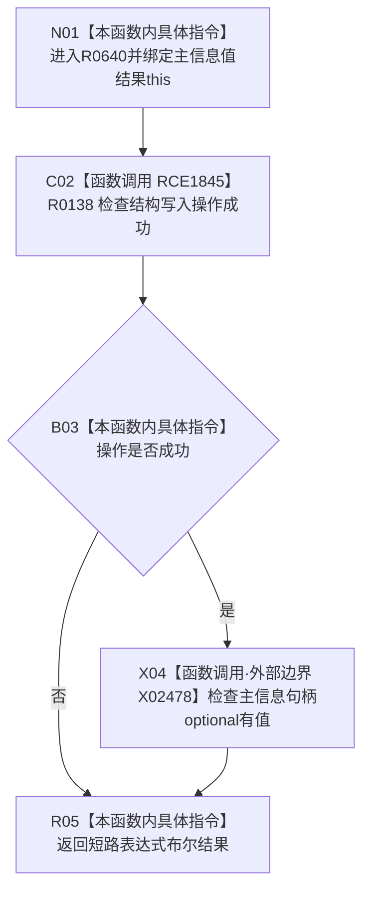

# CF-L10-0109 带主信息值结构写入结果成功现状流程图

图类型：现状流程图
代码版本：`03a8b7ac099ccea83e57f2696e2290b7bcdfacaf`
工作区复核基线：`7cbd2167eb5f6d495f48657a0e5badb07c52a358`
源码 blob：`f54942715c7fce9a678f47fe595ec2080e04427d`
覆盖文件：`海中鱼巣/核心/结果.结构写入.h:43-45`
唯一根函数：R0640
完整签名：`bool 海中鱼巣::带值结构写入结果<海中鱼巣::主信息句柄>::成功() const noexcept`
参数：隐式 `this` 为调用期间有效的非拥有只读借用；模板值类型冻结为主信息句柄
返回结果：操作成功且主信息句柄 optional 有值时返回 `true`，否则返回 `false`
调用图：`流程图/主程序可达调用关系/01_main可达项目调用边表.md`
输入契约 / 调用语境表：本图“当前边界”节；未另建独立表
非成功返回二分审查表：本图返回节点与“当前边界”节；未另建独立表
偏差清单：无 / 不适用；本图只登记当前实现事实
依据提交 / 结构化消息：源码冻结 `03a8b7ac099ccea83e57f2696e2290b7bcdfacaf`；无结构化执行消息
验证输出：配对逐行映射、节点集合、源码 blob 与本批机械审计
已登记调用方：R0634（RCE1824）、R0656（RCE2145）、R0678（RCE2148）、R0696（RCE2150）、R0785（RCE2696）、R0358（RCE2768）、R0405（RCE2824）、R0451（RCE3026）
直接项目函数：R0138（RCE1845）
外部边界：X02478（主信息句柄 optional 的 `has_value()`）
逐行映射表：`流程图/代码流程图/L10/CF-L10-0109_带主信息值结构写入结果成功_逐行代码映射表.md`
结构读写：只读结果字段
逻辑内返回：操作不成功或值为空时返回 `false`
内部错误：本函数不区分操作非成功的具体状态
生命周期与资源释放：无资源获取
不得作为施工许可：是
不得宣称：返回 `true` 等于主信息已提交、已读回或持久证据已完成

## 流程图

## 当前边界

- 第 44 行按 `&&` 短路；操作不成功时不检查 optional。
- 本模板实例只组合两个局部结果字段，不进行仓库读回。
