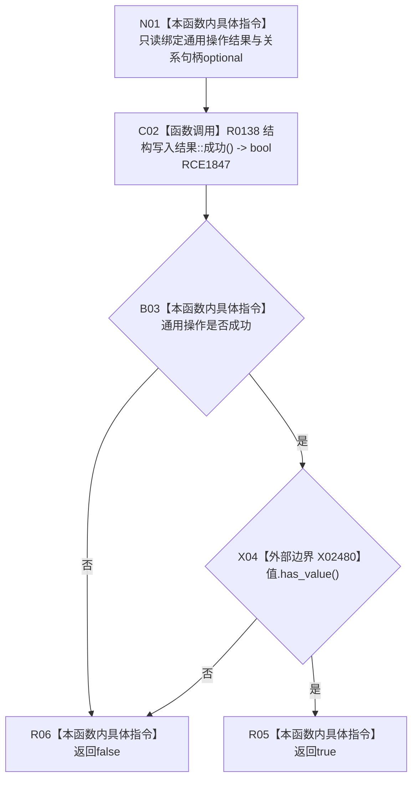

# CF-L10-0111 带值关系结构写入结果成功现状流程图

图类型：现状流程图
代码版本：`03a8b7ac099ccea83e57f2696e2290b7bcdfacaf`
当前工作区复核基线：`7cbd2167eb5f6d495f48657a0e5badb07c52a358`
源码 blob：`f54942715c7fce9a678f47fe595ec2080e04427d`
覆盖文件：`海中鱼巣/核心/结果.结构写入.h:43-45`
唯一根函数：R0642
完整签名：`bool 海中鱼巣::带值结构写入结果<海中鱼巣::关系句柄>::成功() const noexcept`
参数：无显式参数；只读当前结果的 `操作` 与关系句柄 optional `值`
返回结果：通用操作成功且关系句柄值存在时返回 `true`，否则返回 `false`
调用图：`流程图/主程序可达调用关系/01_main可达项目调用边表.md`
输入契约 / 调用语境表：本图“当前边界”节；未另建独立表
非成功返回二分审查表：本图返回节点与“当前边界”节；未另建独立表
偏差清单：无 / 不适用；本图只登记当前实现事实
依据提交 / 结构化消息：源码冻结 `03a8b7ac099ccea83e57f2696e2290b7bcdfacaf`；无结构化执行消息
验证输出：配对逐行映射、节点集合、源码 blob 与本批机械审计
已登记调用方：R0634（RCE1831）、R0655（RCE2144）、R0656（RCE2147）、R0708（RCE2152）、R0023（RCE2426）、R0341（RCE2742）、R0361（RCE2773）、R0362（RCE2774）、R0452（RCE3030）
直接项目函数：R0138（RCE1847）
外部边界：X02480（`optional<关系句柄>::has_value`）
逐行映射表：`流程图/代码流程图/L10/CF-L10-0111_带值关系结构写入结果成功_逐行代码映射表.md`
结构读写：只读结果对象，不修改结构
不得作为施工许可：是
不得宣称：返回 `true` 已证明值对应关系当前有效或持久读回通过

## 流程图

## 当前边界

- `&&` 保持左到右短路；操作不成功时不检查关系句柄 optional。
- 本函数不解引用或验证关系句柄，仅要求 optional 有值。
