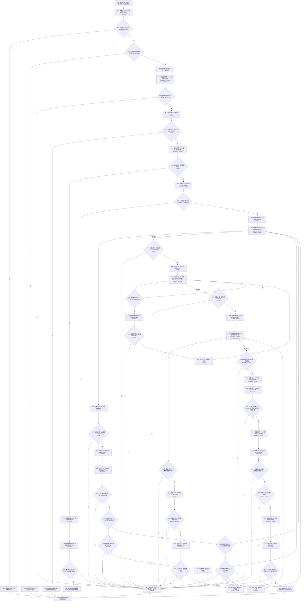

# CF-L10-0112 读取动态材料已许可现状流程图

图类型：现状流程图
代码版本：`03a8b7ac099ccea83e57f2696e2290b7bcdfacaf`
当前工作区复核基线：`f19e4b0e001554d25b1cf0847dbcfb0b52d4e22c`
源码 blob：`cc399ea69282bf3ae0b0d59c7f0b587e5164b187`
覆盖文件：`海中鱼巣/领域/数据操作.状态动态.ixx:1204-1323`
唯一根函数：R0669
完整签名：`海中鱼巣::动态值式材料 海中鱼巣::状态动态数据操作::读取动态材料_已许可(海中鱼巣::节点句柄 动态节点, std::optional<std::uint64_t> 期望主键, const 海中鱼巣::结构事务令牌& 令牌) const`
参数：`动态节点` 和 `期望主键` 按值输入；`令牌` 只读借用；无期望主键时不执行主键相等约束
返回结果：身份失败或类型不匹配材料、期望主键不符的已找到材料、完整抽象动态材料、完整实例动态材料，或经 R0671 形成的内部不一致材料
已登记调用方：R0662、R0663
直接项目函数：R0392（RCE1995）、R0723（RCE1996）、F0383（RCE1997）、R0082（RCE1998）、R0671（RCE1999）、R0078（RCE2000）、R0395（RCE2001）、R0664（RCE2002）、R0396（RCE2003）、R0393（RCE2004）、R0670（RCE2005）、R0665（RCE2006）
外部边界：X02385—X02397、X04858—X04861
调用图：`流程图/主程序可达调用关系/00_main可达函数身份表.md`、`01_main可达项目调用边表.md`、`02_main可达外部边界表.md`
逐行映射表：`流程图/代码流程图/L10/CF-L10-0112_读取动态材料已许可_逐行代码映射表.md`
输入契约 / 调用语境表：本图内嵌审查；无独立文件
非成功返回二分审查表：本图内嵌审查；身份/类型返回与结构内部不一致分账
偏差清单：无独立文件；本批只记录当前代码事实
依据提交 / 结构化消息：冻结源码提交 `03a8b7ac099ccea83e57f2696e2290b7bcdfacaf`、正式稳定边表及顶层稳定边界 ID 裁决 X04858—X04861
验证输出：Mermaid / 节点集合 / 逐行覆盖 PASS；目标 no-index 与全仓 diff 检查 PASS；strict 108/108 PASS；未构建、未运行
不得作为施工许可：是
不得宣称：许可令牌有效、读出材料满足规范，或内部不一致分支已通过运行验证

## 流程图

## 当前边界

- 时间戳缺失进入抽象动态分支；时间戳存在进入实例动态分支，两种材料结构互斥。
- 任一必需关系缺失、重复、端点不可读、因果槽不合法或前后状态不一致均经 R0671 形成内部不一致材料；这些不是普通空候选。
- 期望主键存在但不匹配时，函数保留实际幂等主键并以 `已找到` 提前返回，不继续读取动态正文。
