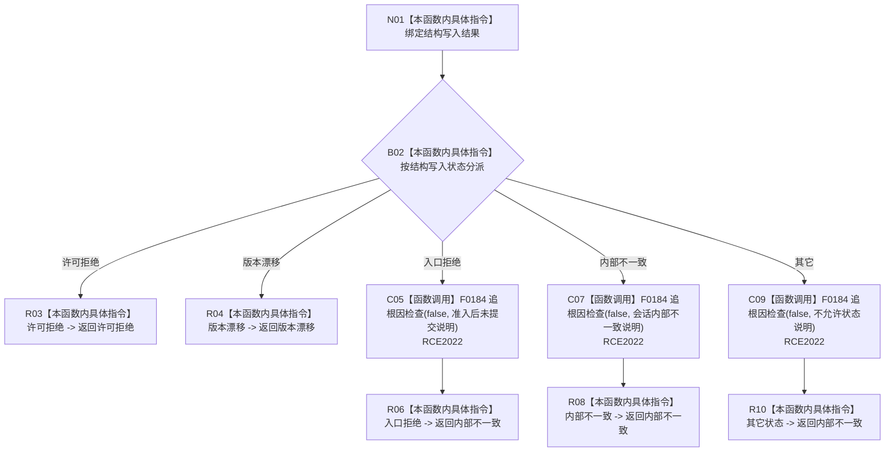

# CF-L10-0113 映射状态动态结构失败现状流程图

图类型：现状流程图
代码版本：`03a8b7ac099ccea83e57f2696e2290b7bcdfacaf`
当前工作区复核基线：`9128ad4375a977d2744b00fcd6f9788d73b4aa7d`
源码 blob：`cc399ea69282bf3ae0b0d59c7f0b587e5164b187`
覆盖文件：`海中鱼巣/领域/数据操作.状态动态.ixx:1828-1844`
唯一根函数：R0677
完整签名：`static 海中鱼巣::状态动态业务结果 海中鱼巣::状态动态数据操作::映射结构失败(const 海中鱼巣::结构写入结果& 结果)`
参数：`结果` 为只读引用，承载结构写入会话的收口状态
返回结果：许可拒绝和版本漂移保持同类业务状态；入口拒绝、内部不一致及其它状态均诊断并返回内部不一致
调用图：`流程图/主程序可达调用关系/01_main可达项目调用边表.md`
逐行映射表：`流程图/代码流程图/L10/CF-L10-0113_映射状态动态结构失败_逐行代码映射表.md`
输入契约 / 调用语境表：本图“当前边界”节；未另建独立表
非成功返回二分审查表：全部返回均为结构失败映射；入口拒绝、内部不一致和默认分支属于追根因解决
偏差清单：无 / 不适用；本图只登记当前实现事实
依据提交 / 结构化消息：源码冻结 `03a8b7ac099ccea83e57f2696e2290b7bcdfacaf`；无结构化执行消息
验证输出：配对逐行映射、节点集合、源码 blob 与本批机械审计
已登记调用方：R0674（RCE2021）
直接项目函数：F0184（RCE2022，三个调用点）
外部边界：无
结构读写：不再改变结构，只消费写入结果并输出业务状态及人读诊断
不得作为施工许可：是
不得宣称：诊断调用改变机器事实，或结构失败根因已经被修复

## 流程图

## 当前边界

- 本函数仅在 R0674 无匹配写后读回且未裁决为幂等冲突时接收结构结果。
- 入口拒绝、内部不一致和默认状态都会产生人读诊断；诊断不是机器状态，业务返回统一为内部不一致。
