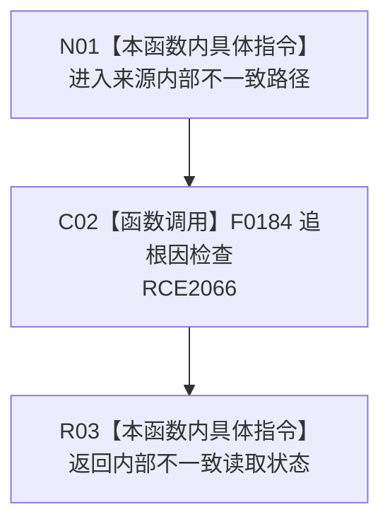

# CF-L10-0114 轻量因果来源内部不一致现状流程图

图类型：现状流程图
代码版本：`03a8b7ac099ccea83e57f2696e2290b7bcdfacaf`
当前工作区复核基线：`9128ad4375a977d2744b00fcd6f9788d73b4aa7d`
源码 blob：`fdc9a1b062b28feffec733dd1a0e342812ef1ddc`
覆盖文件：`海中鱼巣/领域/数据操作.轻量因果.ixx:196-199`
唯一根函数：R0691
完整签名：`海中鱼巣::轻量因果读取状态 海中鱼巣::轻量因果数据操作::来源内部不一致() const`
参数：无显式参数；只读当前数据操作对象
返回结果：触发追根因检查后返回 `轻量因果读取状态::内部不一致`
调用图：`流程图/主程序可达调用关系/00_main可达函数身份表.md`、`01_main可达项目调用边表.md`、`02_main可达外部边界表.md`
已登记调用方：R0690（RCE2064）
直接项目函数：F0184（RCE2066）
外部边界：无
逐行映射表：`流程图/代码流程图/L10/CF-L10-0114_轻量因果来源内部不一致_逐行代码映射表.md`
输入契约 / 调用语境表：本图内嵌审查；仅由来源主信息锚点缺失路径调用
非成功返回二分审查表：本图内嵌审查；固定为追根因解决
偏差清单：无独立文件；本批只记录当前代码事实
依据提交 / 结构化消息：冻结源码提交 `03a8b7ac099ccea83e57f2696e2290b7bcdfacaf` 与正式稳定边表
验证输出：Mermaid / 节点集合 / 逐行覆盖 PASS；目标 no-index 与全仓 diff 检查 PASS；strict 108/108 PASS；未构建、未运行
不得作为施工许可：是
不得宣称：追根因检查已经修复来源结构

## 流程图

## 当前边界

- 本函数不修改仓库；诊断调用是人读/调试证据，返回枚举才是调用方接收的结构化结果。
