# CF-L10-0115 读取二次特征已许可现状流程图

图类型：现状流程图
代码版本：`03a8b7ac099ccea83e57f2696e2290b7bcdfacaf`
当前工作区复核基线：`b8a49bcb141d4fb8940225954dc328e54600030b`
源码 blob：`a47cd9b07794d30abc6cb9d1df319056105cd596`
覆盖文件：`海中鱼巣/领域/数据操作.特征体系.ixx:1330-1384`
唯一根函数：R0705
完整签名：`海中鱼巣::二次特征值式材料 海中鱼巣::特征体系数据操作::读取二次特征_已许可(海中鱼巣::节点句柄 目标, std::optional<std::uint64_t> 期望主键, const 海中鱼巣::结构事务令牌& 令牌) const`
参数：`目标` 按值输入；`期望主键` 按值可选输入；`令牌` 为调用期有效的只读事务令牌引用
返回结果：身份不可读或类型不匹配时返回对应状态材料；主键、引用关系、顺序、组成项类型、端点、证据或连续性异常时返回 R0706 内部不一致材料；全部成立时返回已找到的完整有序材料
调用图：`流程图/主程序可达调用关系/01_main可达项目调用边表.md`
逐行映射表：`流程图/代码流程图/L10/CF-L10-0115_读取二次特征已许可_逐行代码映射表.md`
输入契约 / 调用语境表：本图“当前边界”节；未另建独立表
非成功返回二分审查表：身份读取状态直接传播；已许可后缺主键、关系或有效组成项均由 R0706 作为内部不一致追根因
偏差清单：无 / 不适用；本图只登记当前实现事实
依据提交 / 结构化消息：源码冻结 `03a8b7ac099ccea83e57f2696e2290b7bcdfacaf`；无结构化执行消息
验证输出：配对逐行映射、节点集合、源码 blob 与本批机械审计
已登记调用方：R0704（RCE2104）
直接项目函数：R0344、R0388、R0347、R0078、R0346、R0702、F0051、R0706（RCE2106—RCE2113）
外部边界：X02440—X02459、X04881—X04893、X04895—X04897
结构读写：在既有令牌下只读目标身份、主键和引用关系，装配局部值式材料；不修改持久结构
不得作为施工许可：是
不得宣称：返回已找到证明后续时刻结构仍一致，或内部不一致诊断已经修复根因

## 流程图

```mermaid
flowchart TD
    N01["N01【本函数内具体指令】绑定目标、期望主键和事务令牌"]
    X02["X02【外部边界 X04895】默认构造输出.有序组成项组"]
    X03["X03【外部边界 X04896】默认构造输出.组成关系组"]
    N04["N04【本函数内具体指令】默认构造二次特征输出材料"]
    N05["N05【本函数内具体指令】把目标写入输出.二次特征"]
    C06["C06【函数调用】R0344 读取节点身份_已许可(目标, 令牌) -> 身份<br/>RCE2106"]
    C07["C07【函数调用】R0388 身份.当前可读() -> bool<br/>RCE2107"]
    B08{"B08【本函数内具体指令】目标身份是否当前可读"}
    N09["N09【本函数内具体指令】把身份读取状态写入输出"]
    X90["X90【外部边界 X04886/X04887】释放未返回的输出成员 vector"]
    R10["R10【本函数内具体指令】返回身份失败输出"]
    B11{"B11【本函数内具体指令】目标类型是否为二次特征"}
    N12["N12【本函数内具体指令】把类型不匹配写入输出状态"]
    R13["R13【本函数内具体指令】返回类型不匹配输出"]
    C14["C14【函数调用】R0347 读取唯一主键_已许可(目标, 期望主键, 令牌) -> 主键<br/>RCE2108"]
    X15["X15【外部边界 X02440】主键.has_value() -> bool"]
    B16{"B16【本函数内具体指令】唯一非零主键是否存在"}
    C17["C17【函数调用】R0706 二次特征内部不一致(缺少主键说明) -> 材料<br/>RCE2113"]
    X91["X91【外部边界 X04881/X04886/X04887】释放主键 optional 与输出成员 vector"]
    R18["R18【本函数内具体指令】返回缺少主键的内部不一致材料"]
    C19["C19【函数调用】R0078 获取引用关系记录组(目标, 引用, 令牌) -> 关系组<br/>RCE2109"]
    X20["X20【外部边界 X02442】关系组.empty() -> bool"]
    B21{"B21【本函数内具体指令】组成关系组是否为空"}
    C22["C22【函数调用】R0706 二次特征内部不一致(组成项为空说明) -> 材料<br/>RCE2113"]
    X92["X92【外部边界 X04881/X04882/X04886/X04887】释放关系组、主键与输出容器"]
    R23["R23【本函数内具体指令】返回组成项为空的内部不一致材料"]
    X24["X24【外部边界 X02443/X02445】按关系组长度构造项组"]
    X25["X25【外部边界 X02443/X02446】按关系组长度构造证据组"]
    X26["X26【外部边界 X02444】取得关系组 begin/end"]
    B27{"B27【外部边界 X04888】关系记录循环是否仍有记录"}
    X28["X28【外部边界 X04889】解引用当前关系记录迭代器"]
    N29["N29【本函数内具体指令】绑定当前关系记录引用"]
    B30{"B30【本函数内具体指令】关系顺序号是否小于0"}
    X31["X31【外部边界 X02447】把关系顺序号转换为 size_t"]
    X32["X32【外部边界 X02443】读取关系组.size()"]
    B33{"B33【本函数内具体指令】关系顺序号是否越过组长度"}
    C34["C34【函数调用】R0706 二次特征内部不一致(顺序不连续说明) -> 材料<br/>RCE2113"]
    X93["X93【外部边界 X04881—X04884/X04886—X04887】释放当前路径已构造的 optional 与 vector"]
    R35["R35【本函数内具体指令】返回顺序不连续的内部不一致材料"]
    X36["X36【外部边界 X02447】把顺序号转换为位置"]
    X37["X37【外部边界 X02448/X02451】读取项组位置并检查已有值"]
    B38{"B38【本函数内具体指令】该顺序位置是否重复"}
    C39["C39【函数调用】R0706 二次特征内部不一致(顺序重复说明) -> 材料<br/>RCE2113"]
    R40["R40【本函数内具体指令】返回顺序重复的内部不一致材料"]
    C41["C41【函数调用】R0346 读取关系证据_已许可(记录, 令牌) -> 证据<br/>RCE2110"]
    C42["C42【函数调用】R0344 读取节点身份_已许可(目标节点, 令牌) -> 项身份<br/>RCE2106"]
    X43["X43【外部边界 X02456】证据.has_value() -> bool"]
    B44{"B44【本函数内具体指令】关系证据是否存在"}
    C45["C45【函数调用】R0388 项身份.当前可读() -> bool<br/>RCE2107"]
    B46{"B46【本函数内具体指令】组成项身份是否当前可读"}
    C47["C47【函数调用】R0702 允许二次特征组成项(项身份.类型) -> bool<br/>RCE2111"]
    B48{"B48【本函数内具体指令】组成项类型是否允许"}
    C49["C49【函数调用】F0051 比较记录目标与二次特征目标 -> bool<br/>RCE2112"]
    B50{"B50【本函数内具体指令】组成项是否形成自引用"}
    C51["C51【函数调用】R0706 二次特征内部不一致(类型端点证据说明) -> 材料<br/>RCE2113"]
    X94["X94【外部边界 X04885】释放当前关系证据 optional"]
    R52["R52【本函数内具体指令】返回组成项证据无效的内部不一致材料"]
    X53["X53【外部边界 X02450】取得项组 begin/end"]
    B54{"B54【外部边界 X04891】已有项循环是否仍有元素"}
    X55["X55【外部边界 X04892】解引用当前 optional 项"]
    N56["N56【本函数内具体指令】绑定当前已有 optional 引用"]
    X57["X57【外部边界 X02451】已有.has_value() -> bool"]
    B58{"B58【本函数内具体指令】当前已有位置是否有值"}
    X59["X59【外部边界 X02452】解引用已有节点"]
    C60["C60【函数调用】F0051 比较已有节点与当前目标节点 -> bool<br/>RCE2112"]
    B61{"B61【本函数内具体指令】是否出现重复组成项"}
    C62["C62【函数调用】R0706 二次特征内部不一致(重复组成项说明) -> 材料<br/>RCE2113"]
    R63["R63【本函数内具体指令】返回重复组成项的内部不一致材料"]
    X64["X64【外部边界 X04893】递增 optional 项迭代器"]
    X65["X65【外部边界 X02448/X02453】按位置写入目标节点 optional"]
    X66["X66【外部边界 X02454/X02457/X04897】解引用证据并赋给证据组位置"]
    X67["X67【外部边界 X04890】递增关系记录迭代器"]
    X68["X68【外部边界 X02449】读取项组.size()"]
    X69["X69【外部边界 X02458】为输出有序组成项组 reserve"]
    X70["X70【外部边界 X02455】读取证据组.size()"]
    X71["X71【外部边界 X02459】为输出组成关系组 reserve"]
    N72["N72【本函数内具体指令】初始化输出索引为0"]
    X73["X73【外部边界 X02449】读取项组.size()"]
    B74{"B74【本函数内具体指令】输出索引是否仍在范围内"}
    X75["X75【外部边界 X02448】读取项组[索引]"]
    X76["X76【外部边界 X02451】检查项组位置有值"]
    X77["X77【外部边界 X02454】读取证据组[索引]"]
    X78["X78【外部边界 X02456】检查证据组位置有值"]
    B79{"B79【本函数内具体指令】节点与证据位置是否都已填充"}
    C80["C80【函数调用】R0706 二次特征内部不一致(顺序空洞说明) -> 材料<br/>RCE2113"]
    R81["R81【本函数内具体指令】返回顺序空洞的内部不一致材料"]
    X82["X82【外部边界 X02448】读取项组[索引]"]
    X83["X83【外部边界 X02452】解引用组成项节点"]
    X84["X84【外部边界 X02458】向输出有序组成项组 push_back"]
    X85["X85【外部边界 X02454】读取证据组[索引]"]
    X86["X86【外部边界 X02457】解引用关系证据"]
    X87["X87【外部边界 X02459】向输出组成关系组 push_back"]
    N88["N88【本函数内具体指令】输出索引递增"]
    N89["N89【本函数内具体指令】把已找到写入输出状态"]
    X100["X100【外部边界 X02441】解引用唯一主键"]
    N101["N101【本函数内具体指令】把主键写入输出"]
    N102["N102【本函数内具体指令】把身份主信息写入输出"]
    X103["X103【外部边界 X04881—X04884】释放返回值之外的局部 optional 与 vector"]
    R104["R104【本函数内具体指令】返回已找到的二次特征材料"]
    N01 --> X02 --> X03 --> N04 --> N05 --> C06 --> C07 --> B08
    B08 -- 否 --> N09 --> X90 --> R10
    B08 -- 是 --> B11
    B11 -- 否 --> N12 --> X90 --> R13
    B11 -- 是 --> C14 --> X15 --> B16
    B16 -- 否 --> C17 --> X91 --> R18
    B16 -- 是 --> C19 --> X20 --> B21
    B21 -- 是 --> C22 --> X92 --> R23
    B21 -- 否 --> X24 --> X25 --> X26 --> B27
    B27 -- 否 --> X68
    B27 -- 是 --> X28 --> N29 --> B30
    B30 -- 是 --> C34 --> X93 --> R35
    B30 -- 否 --> X31 --> X32 --> B33
    B33 -- 是 --> C34 --> X93 --> R35
    B33 -- 否 --> X36 --> X37 --> B38
    B38 -- 是 --> C39 --> X93 --> R40
    B38 -- 否 --> C41 --> C42 --> X43 --> B44
    B44 -- 否 --> C51
    B44 -- 是 --> C45 --> B46
    B46 -- 否 --> C51
    B46 -- 是 --> C47 --> B48
    B48 -- 否 --> C51
    B48 -- 是 --> C49 --> B50
    B50 -- 是 --> C51
    B50 -- 否 --> X53 --> B54
    C51 --> X94 --> X93 --> R52
    B54 -- 否 --> X65
    B54 -- 是 --> X55 --> N56 --> X57 --> B58
    B58 -- 否 --> X64 --> B54
    B58 -- 是 --> X59 --> C60 --> B61
    B61 -- 是 --> C62 --> X94 --> X93 --> R63
    B61 -- 否 --> X64 --> B54
    X65 --> X66 --> X94 --> X67 --> B27
    X68 --> X69 --> X70 --> X71 --> N72 --> X73 --> B74
    B74 -- 否 --> N89
    B74 -- 是 --> X75 --> X76 --> X77 --> X78 --> B79
    B79 -- 否 --> C80 --> X93 --> R81
    B79 -- 是 --> X82 --> X83 --> X84 --> X85 --> X86 --> X87 --> N88 --> X73
    N89 --> X100 --> N101 --> N102 --> X103 --> R104
```

## 当前边界

- 调用方必须已经持有有效读取令牌；本函数不自行取得或释放许可。
- 顺序号必须从0连续、无重复、无空洞；每项关系证据、身份、允许类型与非自引用条件均成立后才写入输出材料。
- X04881—X04887 记录局部 optional/vector 与输出未返回路径的隐式释放；X04888—X04893 记录两层范围循环迭代器；X04895—X04897 记录输出容器构造与证据 optional 赋值。
