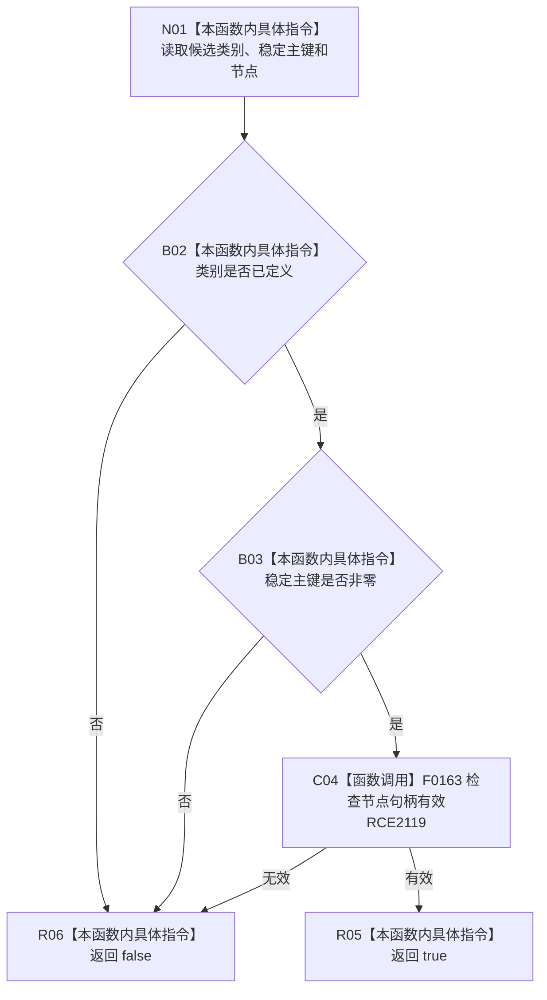

# CF-L10-0116 概念根候选完整现状流程图

图类型：现状流程图
代码版本：`03a8b7ac099ccea83e57f2696e2290b7bcdfacaf`
当前工作区复核基线：`b8a49bcb141d4fb8940225954dc328e54600030b`
源码 blob：`ab7997e84df13fa2105b364f0fdb369d47d9c181`
覆盖文件：`海中鱼巣/领域/数据操作.概念图结构.ixx:61-63`
唯一根函数：R0712
完整签名：`bool 海中鱼巣::概念根候选::完整() const noexcept`
参数：无显式参数；只读当前候选的类别、稳定主键和节点句柄
返回结果：类别已定义、稳定主键非零且节点句柄有效时返回 `true`，否则返回 `false`
调用图：`流程图/主程序可达调用关系/00_main可达函数身份表.md`、`01_main可达项目调用边表.md`、`02_main可达外部边界表.md`
已登记调用方：R0713（RCE2120，四个候选调用点）、R0720（RCE2134）
直接项目函数：F0163（RCE2119）
外部边界：无
逐行映射表：`流程图/代码流程图/L10/CF-L10-0116_概念根候选完整_逐行代码映射表.md`
输入契约 / 调用语境表：本图内嵌审查；候选组完整性检查与单根复核入口共同使用
非成功返回二分审查表：本图内嵌审查；字段不完整返回 `false`，属于数据操作入口完整性判断
偏差清单：无独立文件；本批只记录当前代码事实
依据提交 / 结构化消息：冻结源码提交 `03a8b7ac099ccea83e57f2696e2290b7bcdfacaf` 与正式稳定边表
验证输出：Mermaid / 节点集合 / 逐行覆盖 PASS；目标 no-index 与 strict 检查 PASS；未构建、未运行
不得作为施工许可：是
不得宣称：候选类别与预期根角色相符、稳定主键已绑定或节点当前可读

## 流程图

## 当前边界

- 本函数只检查候选字段形态；根角色类别匹配由 R0713 或后续复核逻辑检查。
