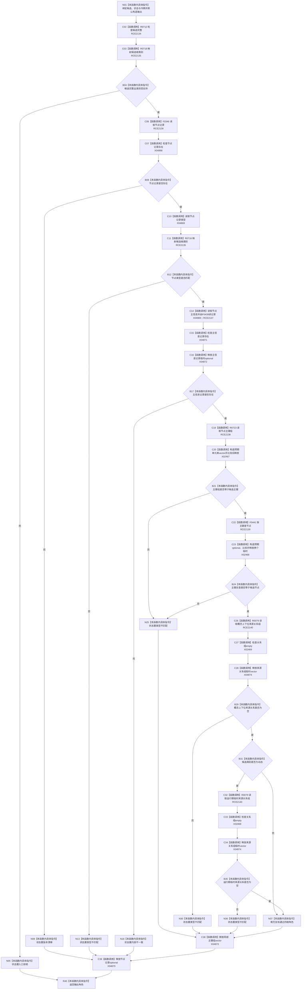

# CF-L10-0117 复核单根已许可现状流程图

图类型：现状流程图
代码版本：`03a8b7ac099ccea83e57f2696e2290b7bcdfacaf`
当前工作区复核基线：`b8a49bcb141d4fb8940225954dc328e54600030b`
源码 blob：`ab7997e84df13fa2105b364f0fdb369d47d9c181`
覆盖文件：`海中鱼巣/领域/数据操作.概念图结构.ixx:393-435`
唯一根函数：R0720
完整签名：`海中鱼巣::概念根角色 海中鱼巣::概念图结构数据操作::复核单根_已许可(const 海中鱼巣::概念根候选& 候选, 海中鱼巣::概念图结构读取状态& 状态, const 海中鱼巣::结构事务令牌& 令牌) const`
参数：`候选`、`令牌` 只读借用；`状态` 可写借用并输出首个复核结果
返回结果：失败时返回默认概念根角色并写状态；成功时返回候选类别、主键、节点和当前主信息
调用图：`流程图/主程序可达调用关系/00_main可达函数身份表.md`、`01_main可达项目调用边表.md`、`02_main可达外部边界表.md`
已登记调用方：R0719（RCE2132）
直接项目函数：R0712（RCE2134）、R0718（RCE2135）、F0346（RCE2136）、F0439（RCE2137）、R0723（RCE2138）、F0441（RCE2139）、R0079（RCE2140）
外部边界：X02467—X02469、X04868—X04874
逐行映射表：`流程图/代码流程图/L10/CF-L10-0117_复核单根已许可_逐行代码映射表.md`
输入契约 / 调用语境表：本图内嵌审查；调用方持有效读取令牌，候选声明类别、稳定主键和节点
非成功返回二分审查表：本图内嵌审查；入口材料无效、版本漂移、类型/索引/关系不匹配和主信息内部不一致分账
偏差清单：X02468 已按实际构造1、比较1、析构2修正 count=4；X04868—X04874 补齐访问与生命周期边界
依据提交 / 结构化消息：冻结源码提交 `03a8b7ac099ccea83e57f2696e2290b7bcdfacaf`、正式稳定边表及顶层 X04868—X04874 / X02468 裁决
验证输出：Mermaid / 节点集合 / 逐行覆盖 PASS；目标 no-index 与全仓 diff 检查 PASS；strict 108/108 PASS；未构建、未运行
不得作为施工许可：是
不得宣称：令牌有效、候选就是权威根，或根关系已经通过运行验收

## 流程图

## 当前边界

- 根节点不得有 `概念上下位` 来源关系；动态根还不得有 `运行期临时` 来源关系。
- 节点记录 `optional` 和局部主键向量分别覆盖其构造后的所有早退，来源关系组临时在各自完整表达式后释放。
