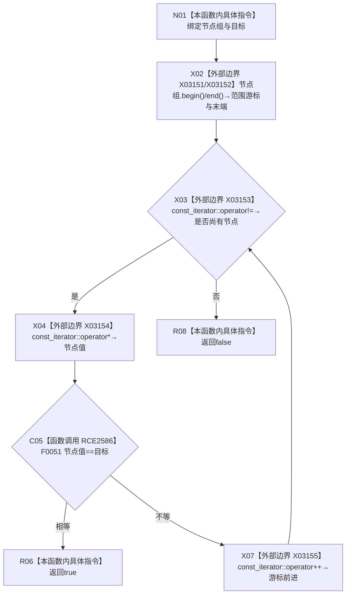

# CF-L10-0118 节点组包含现状流程图

图类型：现状流程图
代码版本：`03a8b7ac099ccea83e57f2696e2290b7bcdfacaf`
当前工作区复核基线：`ef4f7bda76c92c0eb11456cfa267d76f35810616`
源码 blob：`ba08c07c9863ba369a9b2a782a323ea5b5d206a5`
覆盖文件：`海中鱼巣/领域/初始化.语素.ixx:205-212`
唯一根函数：R0760
完整签名：`bool 海中鱼巣::语素初始化服务::节点组包含(const std::vector<节点句柄>& 节点组, 节点句柄 目标) const`
参数：`节点组` 以 const 引用借用；`目标` 按值输入
返回结果：遍历时首次发现与目标相等的节点句柄即返回 `true`；遍历完成无匹配返回 `false`
已登记调用方：R0243（RCE2567，源码有两处调用点）
直接项目函数：F0051（RCE2586）
外部边界：X03151 `begin()`、X03152 `end()`、X03153 const_iterator `operator!=`、X03154 `operator*`、X03155 `operator++`
逐行映射表：`流程图/代码流程图/L10/CF-L10-0118_节点组包含_逐行代码映射表.md`
结构读写：只读传入向量及节点句柄，不改变结构
不得作为施工许可：是
不得宣称：找到相等句柄代表目标当前有效或满足任一业务类型合同

## 流程图

## 当前边界

- 范围 `for` 的五个标准库迭代器操作按词法调用各登记一次；运行时比较、解引用与递增随已遍历元素重复。
- 函数在首个相等项提前返回，不读取后续元素，也不检查重复项。
