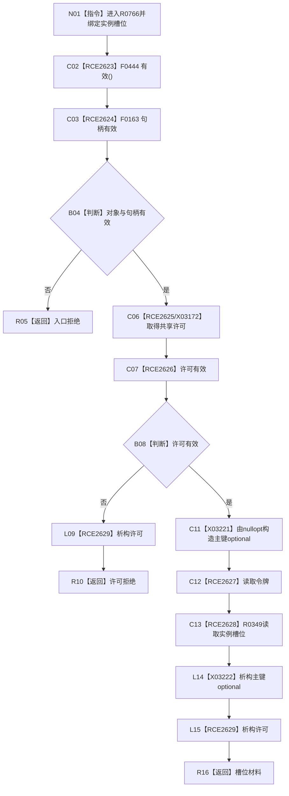

# CF-L10-0120 读取实例特征槽位现状流程图

图类型：现状流程图
代码版本：`03a8b7ac099ccea83e57f2696e2290b7bcdfacaf`
当前工作区复核基线：`ef4f7bda76c92c0eb11456cfa267d76f35810616`
源码 blob：`a47cd9b07794d30abc6cb9d1df319056105cd596`
覆盖文件：`海中鱼巣/领域/数据操作.特征体系.ixx:586-591`
唯一根函数：R0766
完整签名：`特征槽位值式材料 海中鱼巣::特征体系数据操作::读取实例特征槽位(节点句柄 实例槽位) const`
参数：`实例槽位` 值传递节点句柄
返回结果：入口、许可拒绝或 R0349 返回的槽位材料
调用图：`流程图/主程序可达调用关系/00_main可达函数身份表.md`、`01_main可达项目调用边表.md`、`02_main可达外部边界表.md`
已登记调用方：R0756
直接项目函数：F0444、F0163、F0397、F0338、F0339、R0349、F0345（RCE2623—RCE2629）
外部边界：X03172、X03221、X03222
逐行映射表：`流程图/代码流程图/L10/CF-L10-0120_读取实例特征槽位_逐行代码映射表.md`
输入契约 / 调用语境表：本图内嵌审查；调用方按节点句柄读取实例槽位
非成功返回二分审查表：本图内嵌审查；无效入口与许可拒绝为显式结果
偏差清单：无独立文件；本批只记录当前代码事实
依据提交 / 结构化消息：冻结源码提交 `03a8b7ac099ccea83e57f2696e2290b7bcdfacaf`、正式图谱与顶层稳定边裁决
验证输出：Mermaid / 节点集合 / 逐行覆盖 PASS；目标 no-index 检查 PASS；未构建、未运行
不得作为施工许可：是
不得宣称：槽位材料已经完成业务验收

## 流程图

## 当前边界

- 空主键 optional 仅作为 R0349 的值式参数。
