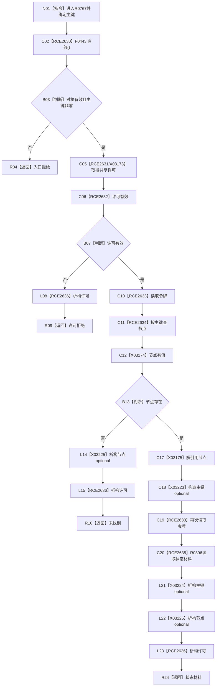

# CF-L10-0121 读取主键状态材料现状流程图

图类型：现状流程图
代码版本：`03a8b7ac099ccea83e57f2696e2290b7bcdfacaf`
当前工作区复核基线：`ef4f7bda76c92c0eb11456cfa267d76f35810616`
源码 blob：`cc399ea69282bf3ae0b0d59c7f0b587e5164b187`
覆盖文件：`海中鱼巣/领域/数据操作.状态动态.ixx:367-374`
唯一根函数：R0767
完整签名：`状态值式材料 海中鱼巣::状态动态数据操作::读取主键状态材料(std::uint64_t 主键) const`
参数：`主键` 值传递
返回结果：入口、许可、未找到或 R0396 返回的状态材料
调用图：`流程图/主程序可达调用关系/00_main可达函数身份表.md`、`01_main可达项目调用边表.md`、`02_main可达外部边界表.md`
已登记调用方：R0758
直接项目函数：F0443、F0397、F0338、F0339、F0441、R0396、F0345（RCE2630—RCE2636）
外部边界：X03173—X03175、X03223—X03225
逐行映射表：`流程图/代码流程图/L10/CF-L10-0121_读取主键状态材料_逐行代码映射表.md`
输入契约 / 调用语境表：本图内嵌审查；调用方按主键读取状态材料
非成功返回二分审查表：本图内嵌审查；入口拒绝、许可拒绝和未找到为显式结果
偏差清单：无独立文件；本批只记录当前代码事实
依据提交 / 结构化消息：冻结源码提交 `03a8b7ac099ccea83e57f2696e2290b7bcdfacaf`、正式图谱与顶层稳定边裁决
验证输出：Mermaid / 节点集合 / 逐行覆盖 PASS；目标 no-index 检查 PASS；未构建、未运行
不得作为施工许可：是
不得宣称：返回状态材料已经完成业务验收

## 流程图

## 当前边界

- 局部节点和主键 optional 的生命周期按退出路径展开。
