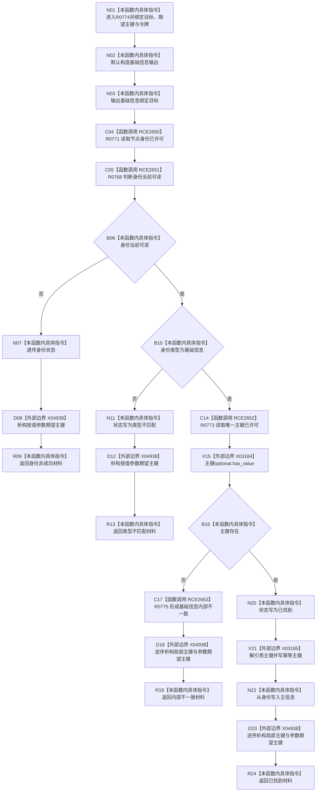

# CF-L10-0122 语素基础数据操作读取基础信息已许可现状流程图

图类型：现状流程图
代码版本：`03a8b7ac099ccea83e57f2696e2290b7bcdfacaf`
当前工作区复核基线：`9fda64b1f2330996913d09dd314fc498303d3e54`
源码 blob：`ccde9a574e3817b75e3d02c9c8f88e244327c06a`
覆盖文件：`海中鱼巣/领域/数据操作.语素基础.ixx:571-592`
唯一根函数：R0774
完整签名：`基础信息值式材料 海中鱼巣::语素基础数据操作::读取基础信息_已许可(节点句柄 目标, std::optional<std::uint64_t> 期望主键, const 结构事务令牌& 令牌) const`
参数：目标节点句柄、可选期望主键与已许可结构事务令牌
返回结果：身份不可读时透传身份状态；类型不匹配时返回类型不匹配；唯一主键缺失时返回内部不一致；其余返回已找到材料
调用图：`流程图/主程序可达调用关系/00_main可达函数身份表.md`、`01_main可达项目调用边表.md`、`02_main可达外部边界表.md`
已登记调用方：R0764（RCE2614）
直接项目函数：R0771（RCE2650）、R0768（RCE2651）、R0773（RCE2652）、R0775（RCE2653）
外部边界：X03184、X03185、X04938
结构读写：只读身份、主键和主信息；只写局部结果材料，不修改仓库
逐行映射表：`流程图/代码流程图/L10/CF-L10-0122_语素基础数据操作读取基础信息已许可_逐行代码映射表.md`
不得作为施工许可：是
不得宣称：已许可令牌由本函数验证，或“已找到”之外的状态已经完成修复

## 流程图

## 当前边界

- 本函数不自行验证令牌；“已许可”是调用语境。X04938 覆盖按值参数及成功进入主键分支后局部 optional 的各返回路径析构。
