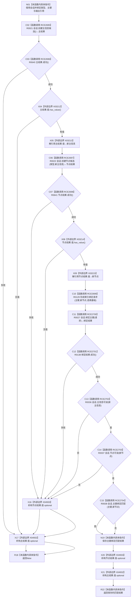

# CF-L10-0123 写入带主键节点会话现状流程图

图类型：现状流程图
代码版本：`03a8b7ac099ccea83e57f2696e2290b7bcdfacaf`
当前工作区复核基线：`9fda64b1f2330996913d09dd314fc498303d3e54`
源码 blob：`ccde9a574e3817b75e3d02c9c8f88e244327c06a`
覆盖文件：`海中鱼巣/领域/数据操作.语素基础.ixx:677-693`
唯一根函数：R0785
完整签名：`static bool 海中鱼巣::语素基础数据操作::写入带主键节点_会话(结构写入会话& 会话, 节点类型 类型, std::uint64_t 主键, 主信息句柄& 新主信息, 节点句柄& 新节点)`
参数：`会话` 以非 const 引用借用并写入候选；`类型`、`主键` 按值输入；`新主信息`、`新节点` 以非 const 引用输出
返回结果：任一候选创建、值提取或主键绑定失败返回 `false`；全部写入后返回主信息、节点和主键绑定三项会话内读回合取结果
已登记调用方：R0784（RCE2693）
直接项目函数：R0021、R0640、R0022、R0641、R0129、R0027、R0138、R0036、R0037、R0638（RCE2695—RCE2704）
外部边界：X03212 主信息 optional `has_value()`；X03213 主信息 optional 解引用；X03214 节点 optional `has_value()`；X03215 节点 optional 解引用；X04932 主信息 optional 析构；X04933 节点 optional 析构
逐行映射表：`流程图/代码流程图/L10/CF-L10-0123_写入带主键节点会话_逐行代码映射表.md`
结构读写：在同一结构写入会话中创建主信息候选和节点候选、绑定主键，并读回三项可见性/匹配事实
不得作为施工许可：是
不得宣称：返回 `false` 时会话会自动撤销，或输出引用仍为空

## 流程图

## 当前边界

- `||` 与 `&&` 保持源码短路：值检查、节点创建和三项读回只在前项通过时继续。
- X04933 仅在节点结果构造后执行，随后 X04932 释放更早构造的主结果 optional；失败返回不主动撤销会话候选。
