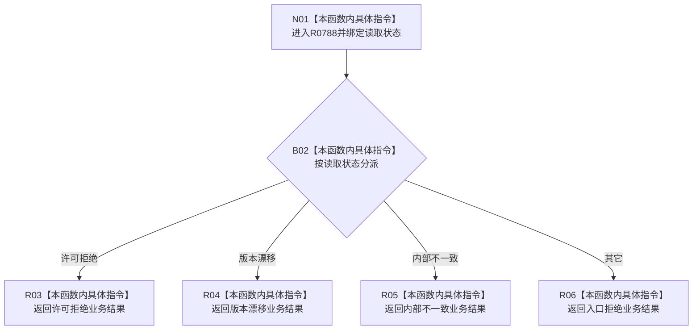

# CF-L10-0124 从读取失败形成结果现状流程图

图类型：现状流程图
代码版本：`03a8b7ac099ccea83e57f2696e2290b7bcdfacaf`
当前工作区复核基线：`9fda64b1f2330996913d09dd314fc498303d3e54`
源码 blob：`ccde9a574e3817b75e3d02c9c8f88e244327c06a`
覆盖文件：`海中鱼巣/领域/数据操作.语素基础.ixx:766-777`
唯一根函数：R0788
完整签名：`static 语义基础业务结果 海中鱼巣::语素基础数据操作::从读取失败形成结果(语义基础读取状态 状态) noexcept`
参数：`状态` 值传递读取状态
返回结果：把许可拒绝、版本漂移、内部不一致映射为同名业务状态；其它映射为入口拒绝
调用图：`流程图/主程序可达调用关系/00_main可达函数身份表.md`、`01_main可达项目调用边表.md`、`02_main可达外部边界表.md`
已登记调用方：R0787
直接项目函数：无
外部边界：无
逐行映射表：`流程图/代码流程图/L10/CF-L10-0124_从读取失败形成结果_逐行代码映射表.md`
输入契约 / 调用语境表：本图内嵌审查；调用方把读取失败转换为业务结果
非成功返回二分审查表：本图内嵌审查；全部分支均为显式状态映射
偏差清单：无独立文件；本批只记录当前代码事实
依据提交 / 结构化消息：冻结源码提交 `03a8b7ac099ccea83e57f2696e2290b7bcdfacaf`、正式图谱与顶层稳定 ID 裁决
验证输出：Mermaid / 节点集合 / 逐行覆盖 PASS；目标 no-index 检查 PASS；未构建、未运行
不得作为施工许可：是
不得宣称：状态映射已经证明上游失败根因得到解决

## 流程图

## 当前边界

- 本函数只做枚举分类，不访问仓库或结构。
