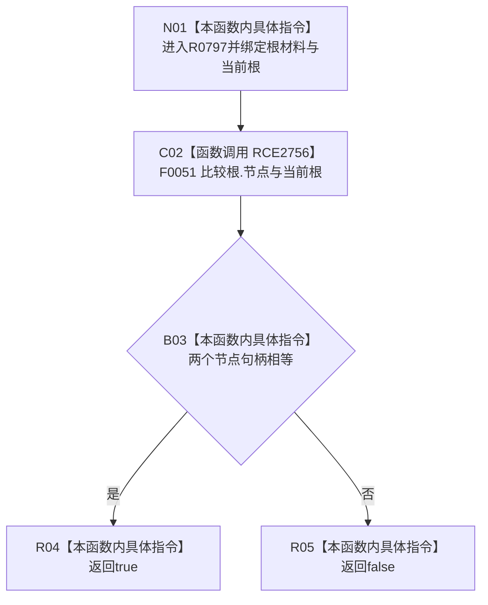

# CF-L10-0126 世界树根匹配谓词现状流程图

图类型：现状流程图
代码版本：`03a8b7ac099ccea83e57f2696e2290b7bcdfacaf`
当前工作区复核基线：`9fda64b1f2330996913d09dd314fc498303d3e54`
源码 blob：`b0b4cdc2cd7e7fd6801f36c7a43bc27595ca89d9`
覆盖文件：`海中鱼巣/领域/控制面板服务.h:953-955`
唯一根函数：R0797
完整签名：`bool 海中鱼巣::控制面板服务::生成世界树(const std::vector<海中鱼巣::节点句柄>&, 海中鱼巣::控制面板请求状态&) const::<lambda@控制面板服务.h:953>::operator()(const 海中鱼巣::控制面板树节点材料& 根) const`
参数：`根` 只读引用；捕获的 `当前根` 为只读引用
返回结果：树节点材料的节点等于当前根时返回 true，否则 false
调用图：`流程图/主程序可达调用关系/00_main可达函数身份表.md`、`01_main可达项目调用边表.md`、`02_main可达外部边界表.md`
已登记调用方：R0326
直接项目函数：F0051（RCE2756）
外部边界：无
逐行映射表：`流程图/代码流程图/L10/CF-L10-0126_世界树根匹配谓词_逐行代码映射表.md`
输入契约 / 调用语境表：本图内嵌审查；`std::find_if` 用该谓词定位当前页根材料
非成功返回二分审查表：本图内嵌审查；false 仅表示当前材料不匹配
偏差清单：无独立文件；本批只记录当前代码事实
依据提交 / 结构化消息：冻结源码提交 `03a8b7ac099ccea83e57f2696e2290b7bcdfacaf`、正式图谱与顶层稳定 ID 裁决
验证输出：Mermaid / 节点集合 / 逐行覆盖 PASS；目标 no-index 检查 PASS；未构建、未运行
不得作为施工许可：是
不得宣称：匹配根材料已经证明世界树业务闭环完成

## 流程图

## 当前边界

- 本函数只比较两个节点句柄，不改变控制面板材料。
