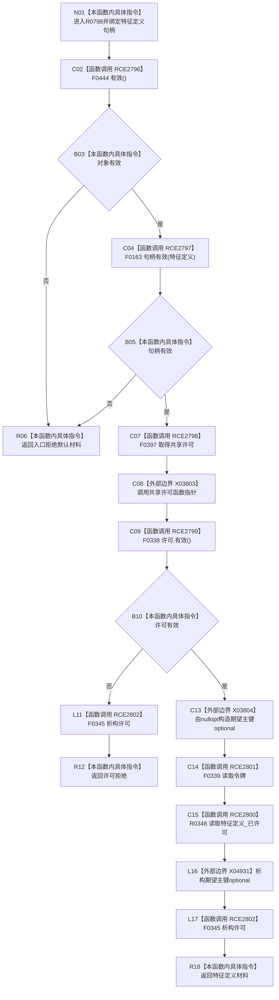

# CF-L10-0127 读取特征定义现状流程图

图类型：现状流程图
代码版本：`03a8b7ac099ccea83e57f2696e2290b7bcdfacaf`
当前工作区复核基线：`9fda64b1f2330996913d09dd314fc498303d3e54`
源码 blob：`a47cd9b07794d30abc6cb9d1df319056105cd596`
覆盖文件：`海中鱼巣/领域/数据操作.特征体系.ixx:570-575`
唯一根函数：R0798
完整签名：`特征定义值式材料 海中鱼巣::特征体系数据操作::读取特征定义(节点句柄 特征定义) const`
参数：`特征定义` 值传递节点句柄；当前对象只读使用接线
返回结果：对象或句柄无效时返回默认材料；许可无效返回许可拒绝；否则返回 R0348 的读取结果
调用图：`流程图/主程序可达调用关系/00_main可达函数身份表.md`、`01_main可达项目调用边表.md`、`02_main可达外部边界表.md`
已登记调用方：R0502、R0389
直接项目函数：F0444、F0163、F0397、F0338、R0348、F0339、F0345（RCE2796—RCE2802）
外部边界：X03803、X03804、X04931
逐行映射表：`流程图/代码流程图/L10/CF-L10-0127_读取特征定义_逐行代码映射表.md`
输入契约 / 调用语境表：本图内嵌审查；调用方按节点句柄读取特征定义材料
非成功返回二分审查表：本图内嵌审查；入口拒绝与许可拒绝为当前显式返回
偏差清单：无独立文件；本批只记录当前代码事实
依据提交 / 结构化消息：冻结源码提交 `03a8b7ac099ccea83e57f2696e2290b7bcdfacaf`、正式图谱与顶层稳定 ID 裁决
验证输出：Mermaid / 节点集合 / 逐行覆盖 PASS；目标 no-index 检查 PASS；未构建、未运行
不得作为施工许可：是
不得宣称：返回材料已经完成本函数之外的业务验收

## 流程图

## 当前边界

- 第 574 行两个实参的求值次序不由本图额外冻结；图只列明真实调用与生命周期。
