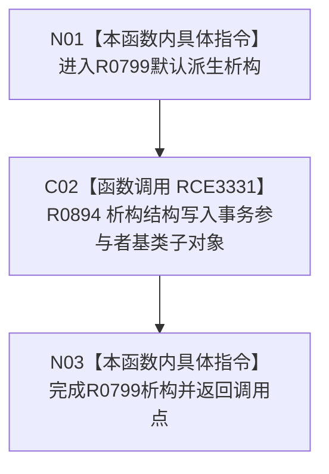

# CF-L10-0128 特征值原始材料事务参与者析构现状流程图

图类型：现状流程图
代码版本：`03a8b7ac099ccea83e57f2696e2290b7bcdfacaf`
当前工作区复核基线：`9fda64b1f2330996913d09dd314fc498303d3e54`
源码 blob：`d82fa092a2c1156d2f8de758d5e32415cb64931d`
覆盖文件：`海中鱼巣/领域/参与者.特征值原始材料.ixx:80-80`
唯一根函数：R0799
完整签名：`海中鱼巣::特征值原始材料事务参与者::~特征值原始材料事务参与者()`
参数：无显式参数；析构当前完整对象；引用成员 `服务_` 不拥有服务生命周期
返回结果：无返回值；默认派生析构结束后析构基类子对象
调用图：`流程图/主程序可达调用关系/00_main可达函数身份表.md`、`01_main可达项目调用边表.md`、`02_main可达外部边界表.md`
已登记调用方：R0389
直接项目函数：R0894（RCE3331；被调图按正式队列后续处理）
外部边界：无
逐行映射表：`流程图/代码流程图/L10/CF-L10-0128_特征值原始材料事务参与者析构_逐行代码映射表.md`
输入契约 / 调用语境表：本图内嵌审查；局部事务参与者离开作用域时隐式调用
非成功返回二分审查表：本图内嵌审查；不适用；默认析构无显式分支
偏差清单：无独立文件；本批只记录当前代码事实
依据提交 / 结构化消息：冻结源码提交 `03a8b7ac099ccea83e57f2696e2290b7bcdfacaf`、正式图谱与顶层稳定 ID 裁决
验证输出：Mermaid / 节点集合 / 逐行覆盖 PASS；目标 no-index 检查 PASS；未构建、未运行
不得作为施工许可：是
不得宣称：事务参与者关联的业务提交、发布或撤销已经完成

## 流程图

## 当前边界

- R0894 是基类虚析构项目身份；本图不越序生成其被调流程图。
